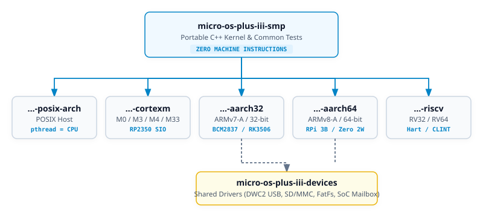
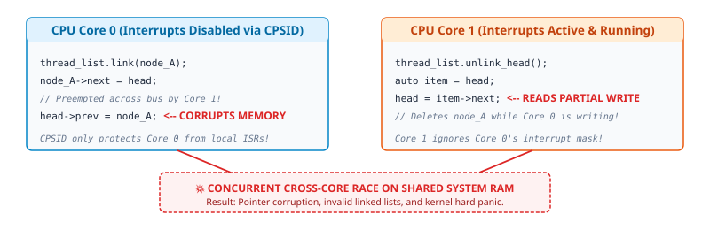
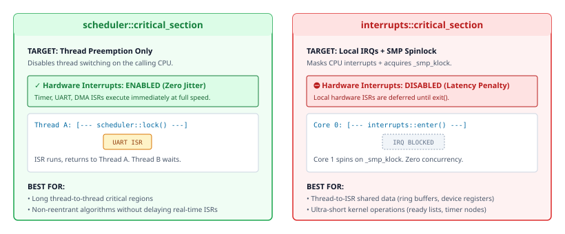
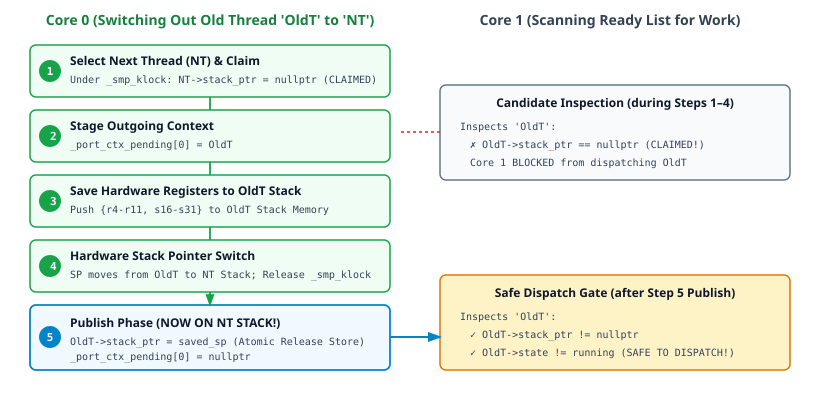
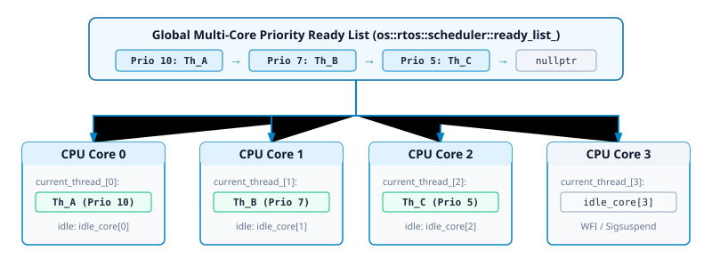
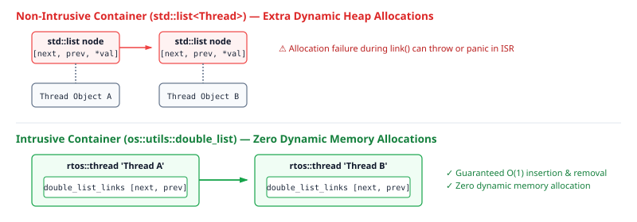
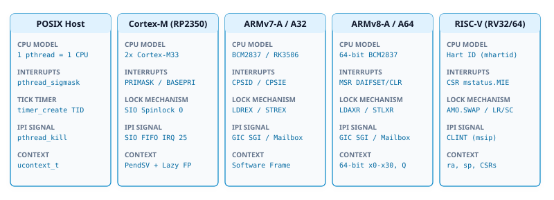

# Technical Analysis & Architectural Guide: µOS++ III — Single-Core (`xpack-development`) vs. Multi-Core SMP (`smp`)

**Author:** Antigravity AI Engineering Team  
**Date:** September 2026  
**Target Architectures:** ARMv8-A (AArch64), ARMv7-A (AArch32), ARMv8-M / ARMv7-M (Cortex-M), POSIX (Native Host Multi-Thread Emulation), RISC-V  
**Language Standards:** ISO/IEC 14882:2017 (C++17) & ISO/IEC 14882:2020 (C++20)

---

## Table of Contents

1. [Executive Overview & Architectural Philosophy](#1-executive-overview--architectural-philosophy)
2. [Locking, Synchronization & Concurrency Model](#2-locking-synchronization--concurrency-model)
   - 2.1 [The Single-Core Paradigm: Interrupt Masking](#21-the-single-core-paradigm-interrupt-masking)
   - 2.2 [The SMP Multi-Core Paradigm: Why Masking Fails](#22-the-smp-multi-core-paradigm-why-masking-fails)
   - 2.3 [The Recursive Kernel Spinlock (`_smp_klock`)](#23-the-recursive-kernel-spinlock-_smp_klock)
   - 2.4 [Scheduler Critical Section vs. Interrupts Critical Section](#24-scheduler-critical-section-vs-interrupts-critical-section)
   - 2.5 [Fine-Grained vs. Coarse-Grained Locking: The Timer Leaf Lock (`_smp_tlock`)](#25-fine-grained-vs-coarse-grained-locking-the-timer-leaf-lock-_smp_tlock)
   - 2.6 [Hardware Locks, Exclusive Monitors & ISA Primitives](#26-hardware-locks-exclusive-monitors--isa-primitives)
   - 2.7 [Critical and Uncritical Section Protocols](#27-critical-and-uncritical-section-protocols)
   - 2.8 [Data Race Prevention and Memory Ordering](#28-data-race-prevention-and-memory-ordering)
3. [Context Switching & The Deferred Publish Protocol](#3-context-switching--the-deferred-publish-protocol)
   - 3.1 [The Cross-Core Stack Corruption Hazard](#31-the-cross-core-stack-corruption-hazard)
   - 3.2 [The Deferred Publish / Claim Mechanism](#32-the-deferred-publish--claim-mechanism)
   - 3.3 [Context Switching Mechanics Across Target Architectures](#33-context-switching-mechanics-across-target-architectures)
   - 3.4 [Floating Point Unit (FPU) Context & Lazy Stacking](#34-floating-point-unit-fpu-context--lazy-stacking)
4. [Scheduler Architecture & Thread Lifecycle](#4-scheduler-architecture--thread-lifecycle)
   - 4.1 [Scheduler Data Structures: Single-Core vs. SMP](#41-scheduler-data-structures-single-core-vs-smp)
   - 4.2 [Thread CPU Affinity & The Multi-Core Ready-List Picker](#42-thread-cpu-affinity--the-multi-core-ready-list-picker)
   - 4.3 [Thread Lifecycle, Teardown (`state::destroying`), and Join Synchronization](#43-thread-lifecycle-teardown-statedestroying-and-join-synchronization)
   - 4.4 [Inter-Processor Interrupts (IPI) & Preemption Bounds](#44-inter-processor-interrupts-ipi--preemption-bounds)
5. [Intrusive Lists & Core Data Structures](#5-intrusive-lists--core-data-structures)
   - 5.1 [Why Intrusive Containers in Embedded RTOS Design](#51-why-intrusive-containers-in-embedded-rtos-design)
   - 5.2 [Design and Mechanics of `os::utils::double_list`](#52-design-and-mechanics-of-osutilsdouble_list)
   - 5.3 [SMP List Safety & Concurrency Traps](#53-smp-list-safety--concurrency-traps)
   - 5.4 [Static Destruction & The Clean `_Exit()` Bypass](#54-static-destruction--the-clean-_exit-bypass)
6. [C++ Object-Oriented Solutions, Idioms & Standards](#6-c-object-oriented-solutions-idioms--standards)
   - 6.1 [Modern C++ RAII & Scope-Guarded Execution](#61-modern-c-raii--scope-guarded-execution)
   - 6.2 [Polymorphic Memory Resources (`pmr`) & Allocator Safety](#62-polymorphic-memory-resources-pmr--allocator-safety)
   - 6.3 [CMSIS-RTOS Dual-Layer Architecture (C/C++ Interop)](#63-cmsis-rtos-dual-layer-architecture-cc-interop)
   - 6.4 [Polymorphism & Virtual Destructor Safety](#64-polymorphism--virtual-destructor-safety)
   - 6.5 [C++20 Compliance: Volatile Deprecation & Atomics](#65-c20-compliance-volatile-deprecation--atomics)
7. [Architecture-Specific Ports: Deep Technical Breakdown](#7-architecture-specific-ports-deep-technical-breakdown)
   - 7.1 [POSIX Native Host Port (`micro-os-plus-iii-posix-arch`)](#71-posix-native-host-port-micro-os-plus-iii-posix-arch)
   - 7.2 [ARM Cortex-M Port (`micro-os-plus-iii-cortexm`)](#72-arm-cortex-m-port-micro-os-plus-iii-cortexm)
   - 7.3 [ARMv7-A / AArch32 Port (`micro-os-plus-iii-aarch32`)](#73-armv7-a--aarch32-port-micro-os-plus-iii-aarch32)
   - 7.4 [ARMv8-A / AArch64 Port (`micro-os-plus-iii-aarch64`)](#74-armv8-a--aarch64-port-micro-os-plus-iii-aarch64)
   - 7.5 [RISC-V Port (`micro-os-plus-iii-riscv`)](#75-risc-v-port-micro-os-plus-iii-riscv)
8. [Hardening, Bug Fixes & Upstream Integration Strategy](#8-hardening-bug-fixes--upstream-integration-strategy)
   - 8.1 [Kernel Defect Catalog & Historical Remediation](#81-kernel-defect-catalog--historical-remediation)
   - 8.2 [The 30-Step Structured Integration Plan](#82-the-30-step-structured-integration-plan)
   - 8.3 [The 72-Test Verification Gate](#83-the-72-test-verification-gate)

---

# 1. Executive Overview & Architectural Philosophy

The **µOS++ III** project (micro-os-plus-iii) is a modern, modular, object-oriented C++ Real-Time Operating System designed for high-reliability embedded systems, microcontrollers, and multi-core processors. It is structured around clean object abstractions conforming to CMSIS-RTOS v1/v2, POSIX threads (IEEE Std 1003.1), and ISO C++ standard library synchronization primitives.

Within the repository ecosystem, two major branches represent fundamentally different operating models:

| Dimension | `xpack-development` (Single-Core Upstream) | `smp` (Multi-Core Symmetric Multiprocessing) |
|---|---|---|
| **Execution Topology** | Single uniprocessor CPU core (`OS_NCPU = 1`). | $N$ identical symmetric CPU cores ($N \ge 1$, typical $N \in \{2, 3, 4, 8\}$). |
| **Scheduler State** | Global single active thread `current_thread_`, single `os_idle_thread`. | Per-CPU `current_thread_[OS_NCPU]`, per-CPU idle threads `os_idle_thread_core[OS_NCPU]`. |
| **Concurrency Control** | Local interrupt disable (`CPSID`, `PRIMASK`, `sigprocmask`). | Two-phase critical section: Per-CPU interrupt masking + Recursive Kernel Spinlock (`_smp_klock`). |
| **Context Switching** | Immediate stack pointer reassignment. | Two-phase **Deferred Publish / Claim Protocol** to prevent concurrent stack execution. |
| **Thread Affinity** | None (all threads run on the sole CPU). | Per-thread CPU affinity bitmask (`th_cpu_affinity`), affinity-aware scheduler picker. |
| **Thread Migration** | Irrelevant. | Free migration across cores (unless pinned), with strict ban on native TLS caching. |
| **Architecture Ports** | Monolithic uniprocessor ports. | Decoupled, multi-repo architecture ports (`aarch32`, `aarch64`, `cortexm`, `posix-arch`, `riscv`). |



### The Division of Labour
To maintain strict mergeability with upstream while enabling clean architecture-specific extensions, dependencies run in **one direction**:
1. **The Kernel (`micro-os-plus-iii-smp`)**: Contains zero machine assembly instructions. It implements the portable scheduling algorithms, synchronization logic, timing lists, and object lifecycles.
2. **Architecture Ports (`micro-os-plus-iii-<arch>`)**: Provide machine-specific word sizes, interrupt masking instructions, CPU ID extraction, hardware timers, and context switch assembly.
3. **Device Layer (`micro-os-plus-iii-devices`)**: Shared drivers (DWC2 USB controller, SD card, FlatFS, SoC mailboxes) identical across 32-bit and 64-bit ARM architectures.

---

# 2. Locking, Synchronization & Concurrency Model

## 2.1 The Single-Core Paradigm: Interrupt Masking
In the uniprocessor branch (`xpack-development`), only a single thread or interrupt service routine (ISR) can execute at any physical point in time. Uniprocessor concurrency conflicts arise solely from **asynchronous preemption** (e.g., a timer interrupt firing and triggering a context switch in the middle of a linked-list update).

Therefore, the single-core synchronization model is deceptively simple:
```cpp
// Single-Core Critical Section:
inline rtos::interrupts::state_t critical_section::enter (void) {
    return port::interrupts::critical_section::enter (); // e.g., __disable_irq() / cpsid i
}
inline void critical_section::exit (rtos::interrupts::state_t state) {
    port::interrupts::critical_section::exit (state);    // e.g., __enable_irq() / cpsie i
}
```
Because no other core exists to observe or mutate memory simultaneously, masking local CPU interrupts guarantees absolute, immediate atomicity across the entire system.

## 2.2 The SMP Multi-Core Paradigm: Why Masking Fails
On an SMP multi-core system, disabling interrupts on CPU Core 0 has **zero effect** on CPU Core 1, Core 2, or Core 3. While Core 0 has masked its interrupts to manipulate a thread queue, Core 1 can simultaneously execute user or kernel code, dereference the same pointers, and write to the same memory addresses, causing catastrophic data corruption.



## 2.3 The Recursive Kernel Spinlock (`_smp_klock`)
To guarantee mutual exclusion across all cores, the `smp` branch introduces a global **Recursive Kernel Spinlock**. Every kernel state modification is protected by a two-phase lock:
1. **Phase 1: Disable local interrupts on the calling core** (preventing local ISR preemption while holding the lock).
2. **Phase 2: Acquire the cross-core spinlock** (preventing concurrent execution by other cores).

### Data Structure Definition
```c
typedef struct {
    volatile uint32_t lock;   // 0 = unlocked, 1 = locked
    volatile uint32_t owner;  // CPU ID of owner, or SMP_NO_OWNER (0xFFFFFFFF)
    volatile uint32_t depth;  // Nesting depth for recursive critical sections
} smp_klock_t;
```

### Spinlock Acquisition (`_smp_klock_raw_acquire`)
```cpp
inline void _smp_klock_raw_acquire (void) {
    while (__atomic_exchange_n (&_smp_klock.lock, 1u, __ATOMIC_ACQUIRE) != 0u) {
#if defined(__x86_64__) || defined(__i386__)
        __builtin_ia32_pause ();              // PAUSE instruction: reduces pipeline thrashing
#elif defined(__aarch64__) || defined(__arm__)
        __asm__ volatile ("yield" ::: "memory"); // YIELD instruction: informs SMT/interconnect
#elif defined(__riscv)
        __asm__ volatile ("pause" ::: "memory");
#endif
    }
}
```

### The Recursive Protocol
```cpp
inline rtos::interrupts::state_t critical_section::enter (void) {
    // 1. Mask local interrupts on THIS core first
    rtos::interrupts::state_t prior_irq = port_mask_local_interrupts ();

    const unsigned cpu = scheduler::port_cpu_id_inline ();
    // 2. Check reentrancy
    if (scheduler::_smp_klock.owner != cpu) {
        scheduler::_smp_klock_raw_acquire ();
        scheduler::_smp_klock.owner = cpu;
    }
    scheduler::_smp_klock.depth++;
    return prior_irq;
}

inline void critical_section::exit (rtos::interrupts::state_t prior_irq) {
    const unsigned cpu = scheduler::port_cpu_id_inline ();
    if (scheduler::_smp_klock.owner == cpu && scheduler::_smp_klock.depth > 0) {
        scheduler::_smp_klock.depth--;
        if (scheduler::_smp_klock.depth == 0) {
            // CRITICAL ORDER: Clear owner FIRST, release lock word LAST with RELEASE barrier
            scheduler::_smp_klock.owner = SMP_NO_OWNER;
            __atomic_store_n (&scheduler::_smp_klock.lock, 0u, __ATOMIC_RELEASE);
        }
    }
    // 3. Restore local interrupt mask
    port_restore_local_interrupts (prior_irq);
}
```

> **Why Owner Must Be Cleared Before Lock Word:**  
> If the atomic store to `lock = 0` occurred *before* `owner = SMP_NO_OWNER`, another core waiting in `_smp_klock_raw_acquire()` could immediately acquire `lock = 1`, read `owner` before it was updated, and observe a corrupted or stale owner ID. Setting `owner = SMP_NO_OWNER` before the store with release semantics guarantees memory consistency across the memory bus.

## 2.4 Scheduler Critical Section vs. Interrupts Critical Section

In real-time embedded software design, conflating scheduler locking with interrupt masking is one of the most common causes of system failure and priority inversion. µOS++ provides two distinct synchronization abstractions:



| Property | `scheduler::critical_section` | `interrupts::critical_section` |
|---|---|---|
| **Target Scope** | Thread-to-Thread Preemption Only. | Thread-to-ISR and Cross-Core Hardware Bus. |
| **Hardware IRQs** | **ENABLED** (Zero interrupt jitter/latency). | **DISABLED / MASKED** on the calling core. |
| **SMP Locking** | Sets `lock_state[cpu] = locked`. | Acquires global `_smp_klock` recursively. |
| **Allowed Context** | Thread Mode ONLY (`!in_handler_mode()`). | Thread Mode AND Handler Mode (ISRs). |
| **Blocking Calls** | **FORBIDDEN** (Throws `EPERM` assert). | **FORBIDDEN** (Deadlocks system). |
| **Duration** | Can be long (e.g. non-reentrant algorithms). | Must be ultra-short (a few clock cycles). |

### 1. Scheduler Critical Section (`scheduler::critical_section`)
**Purpose & Guarantees**:  
When a thread enters `scheduler::critical_section`, it prevents the RTOS scheduler from switching context away to another thread on the current CPU core. However, **hardware interrupts (SysTick, UART, DMA, CAN, Ethernet) remain fully enabled**.

```cpp
// RAII Usage of Scheduler Critical Section:
{
    os::rtos::scheduler::critical_section scs; // Scheduler locked on this core
    // Long-running non-reentrant user calculation or legacy C library function
    process_complex_buffer(shared_data);
    // Hardware interrupts fire seamlessly without missing data packets!
} // Exiting automatically unlocks scheduler and triggers deferred reschedule if pending
```

**SMP Implementation Mechanics**:  
In `os-core.cpp`, `scheduler::locked(state)` guards against thread migration while modifying `lock_state[cpu]`:
```cpp
state_t locked (state_t state) {
    os_assert_throw (!interrupts::in_handler_mode (), EPERM);
#if defined(OS_USE_SMP_SCHEDULER)
    // Mask IRQs temporarily BEFORE reading port_cpu_id() to prevent migration
    uint32_t pri = __get_PRIMASK ();
    __asm__ volatile ("cpsid i" ::: "memory");
    unsigned cpu = port_cpu_id ();
    state_t tmp = lock_state[cpu];
    if (state != tmp) {
        if (state == state::locked) {
            port_set_lock ();
            lock_primask[cpu] = pri;
            lock_state[cpu] = state;
        } else {
            lock_state[cpu] = state;
            port_put_lock (lock_primask[cpu]);
        }
    } else {
        __set_PRIMASK (pri);
    }
    return tmp;
#endif
}
```

**Strict Rule — No Blocking Operations**:  
A thread holding `scheduler::critical_section` must *never* execute blocking primitives (`sleep_for()`, `semaphore::wait()`, `mutex::lock()`, `mqueue::receive()`). All kernel blocking paths enforce this via:
```cpp
os_assert_err (!scheduler::locked (), EPERM);
```
If a thread blocked while the scheduler was locked, the scheduler would be unable to perform a context switch to idle or another thread, hanging the CPU core permanently.

### 2. Interrupts Critical Section (`interrupts::critical_section`)
**Purpose & Guarantees**:  
Disables all maskable hardware interrupts on the calling core and takes the global `_smp_klock`. It provides total, atomic mutual exclusion across the entire SoC.

**When to Use**:  
- Protecting data shared between a **Thread and an ISR** (e.g. a hardware FIFO buffer read by a thread and written by an interrupt).
- Manipulating low-level kernel intrusive structures (`ready_list_`, `timer_node`, memory pool headers).

**Why Duration Must Be Minimized**:  
Because hardware interrupts are masked, any ISR raised while in `interrupts::critical_section` is delayed until exit. Prolonged interrupt critical sections cause **dropped hardware packets, UART buffer overruns, and motor control jitter**.

## 2.5 Fine-Grained vs. Coarse-Grained Locking: The Timer Leaf Lock (`_smp_tlock`)
Holding the global `_smp_klock` during high-frequency hardware timer updates creates severe bus contention. To decouple timer management from thread scheduling, the `smp` branch implements a fine-grained **Timer Leaf Lock** (`_smp_tlock`):
- `port_tmr_lock()` / `port_tmr_unlock()` lock only the timer list during arming and disarming operations.
- Thread scheduling and list reordering continue uninterrupted on other cores.

## 2.6 Hardware Locks, Exclusive Monitors & ISA Primitives

| Architecture | Primitive | Implementation Details |
|---|---|---|
| **AArch64** | `LDAXR` / `STLXR` | Load-Acquire Exclusive / Store-Release Exclusive on global address space. Synchronized by the ARMv8 Point of Coherency (PoC). |
| **AArch32** | `LDREX` / `STREX` | Load/Store Exclusive with data synchronization barrier `DMB ISH` (Inner Shareable). |
| **RP2350 (Cortex-M33)** | SIO Spinlock 0 | **Hardware Spinlock Registers** at `0xD0000100`. The RP2350 has no global exclusive monitor across cores; standard `LDREX`/`STREX` only works within a single core. Hardware SIO spinlocks provide single-cycle atomic test-and-set. |
| **POSIX Host** | `__atomic_exchange_n` | GCC/Clang built-in atomic exchange mapping to `LOCK XCHG` on x86-64 or `LDXR`/`STXR` on host ARM. |
| **RISC-V** | `AMO.SWAP.W.AQ` | Atomic Memory Operation with acquire/release annotation. |

## 2.7 Critical and Uncritical Section Protocols
In real-time multi-threading, an executing thread inside a critical section occasionally needs to temporarily drop the lock (e.g., when yielding, waiting on a resource, or boosting a mutex owner) and subsequently re-acquire it:

```cpp
// RAII Uncritical Section: Temporarily drops the kernel lock and unmasks IRQs
class uncritical_section {
public:
    uncritical_section () {
        saved_depth_ = scheduler::_smp_klock.depth;
        saved_irq_ = port_read_irq_state ();
        // Fully unwind kernel lock
        scheduler::_smp_klock.depth = 0;
        scheduler::_smp_klock.owner = SMP_NO_OWNER;
        __atomic_store_n (&scheduler::_smp_klock.lock, 0u, __ATOMIC_RELEASE);
        port_unmask_local_interrupts ();
    }
    ~uncritical_section () {
        port_mask_local_interrupts ();
        scheduler::_smp_klock_raw_acquire ();
        scheduler::_smp_klock.owner = scheduler::port_cpu_id_inline ();
        scheduler::_smp_klock.depth = saved_depth_;
        port_restore_local_interrupts (saved_irq_);
    }
private:
    uint32_t saved_depth_;
    rtos::interrupts::state_t saved_irq_;
};
```

## 2.8 Data Race Prevention and Memory Ordering
In modern C++20, compound operations on `volatile` types (such as `++g_counter`) are officially deprecated ([depr.volatile.type]) because `volatile` guarantees only register reload/store suppression, not CPU cache synchronization or bus atomicity.

In the `smp` branch:
- All cross-core counters and status flags are upgraded to `std::atomic<uint32_t>` or `std::atomic_flag`.
- Memory barriers (`__ATOMIC_ACQUIRE`, `__ATOMIC_RELEASE`, `__ATOMIC_SEQ_CST`) are explicitly declared, compiling to hardware barriers (`DMB ISH`, `DSB SY`, `ISB`).

---

# 3. Context Switching & The Deferred Publish Protocol

## 3.1 The Cross-Core Stack Corruption Hazard
The most difficult engineering challenge in SMP RTOS design is **thread context handover**.

In a uniprocessor RTOS (`xpack-development`):
1. Thread A decides to yield or block.
2. Context switch handler pushes registers onto Thread A's stack.
3. Thread A's saved stack pointer is written to `ThreadA->stack_ptr`.
4. The scheduler selects Thread B, restores registers from `ThreadB->stack_ptr`, and resumes.

**Why this breaks on SMP:**  
Suppose Core 0 is switching away from Thread A to Thread B.
1. Core 0 decides to yield Thread A and puts Thread A back onto the ready list.
2. Core 1 is searching for a ready thread, finds Thread A in the ready list, and immediately dispatches it.
3. Core 1 loads Thread A's stack pointer and starts executing Thread A's code.
4. **FATAL RACE:** Core 0 has *not yet finished saving its registers to Thread A's stack!* Core 0 and Core 1 are now pushing, popping, and mutating the **exact same stack concurrently**, resulting in corrupted stack frames, register aliasing, and hard faults.

## 3.2 The Deferred Publish / Claim Mechanism
The `smp` branch solves this cross-core hazard via a formal **Deferred Publish / Claim Protocol**.



### Step 1: The Claim Phase (Picker)
When the scheduler picks candidate thread `th` from the ready list:
```cpp
// Inside scheduler::internal_switch_threads() under _smp_klock:
next_thread->context_.port_.stack_ptr = nullptr; // CLAIM: Marks context active/in-flight
```
Setting `stack_ptr = nullptr` informs all other cores that this thread is currently claimed and cannot be picked, even if its state is still ready.

### Step 2: The Deferred Save Phase
The outgoing thread's pointer is stored in a per-core pending slot:
```cpp
_port_ctx_pending[port_cpu_id ()] = (uintptr_t) old_thread;
```

### Step 3: The Publish Phase
Only after the hardware stack pointer (SP) has physically transitioned to the new thread's stack and the outgoing registers are fully committed to memory does the core "publish" the saved SP:
```cpp
// Executing ON THE NEW THREAD'S STACK:
void publish_pending (void) {
    unsigned cpu = port_cpu_id ();
    rtos::thread* old = (rtos::thread*) _port_ctx_pending[cpu];
    if (old != nullptr) {
        _port_ctx_pending[cpu] = 0;
        // Release store publishes saved stack pointer to the entire system
        __atomic_store_n (&old->context_.port_.stack_ptr, old_saved_sp, __ATOMIC_RELEASE);
    }
}
```

### Step 4: The Ready List Gate
The scheduler ready-list picker checks both thread state and stack pointer:
```cpp
inline bool is_thread_ready_to_run (rtos::thread* th, rtos::thread* old_thread) {
    if (th == old_thread) {
        return true; // Rescheduling self is always safe
    }
    // Must not be currently executing on another CPU AND must have a published stack
    return (th->state_ != rtos::thread::state::running) &&
           (th->context_.port_.stack_ptr != nullptr);
}
```

## 3.3 Context Switching Mechanics Across Target Architectures

### 1. POSIX Host (`ucontext_t`)
- Uses `makecontext` and `swapcontext` within host threads.
- Context layout:
  ```c
  typedef struct {
      os_port_thread_stack_element_t* stack_ptr; // FIRST member for atomic publish
      os_impl_ucontext_t ucontext;
  } os_port_thread_context_t;
  ```
- **Trampoline Initialization:** Brand new threads enter via an assembly/C++ trampoline that executes `publish_pending()` and unmasks signals *before* entering the user thread function.

### 2. ARM Cortex-M (PendSV Exception Handler)
- **Cooperative & Preemptive:** Triggers the `PendSV` interrupt vector (`SCB->ICSR = SCB_ICSR_PENDSVSET_Msk`).
- **Hardware Stacking:** Hardware automatically saves `{r0-r3, r12, lr, pc, xPSR}` on the Process Stack Pointer (PSP).
- **Software Stacking:** `PendSV_Handler` saves `{r4-r11}` (and `{s16-s31}` if FPU is active), stores PSP to `old_thread->stack_ptr`, loads new PSP from `next_thread->stack_ptr`, and executes the deferred publish.

### 3. ARMv7-A / AArch32
- Saves user-mode registers `{r0-r12, lr, pc, cpsr}` into the thread's stack frame.
- Uses `CPSID i` / `CPSIE i` for local CPU interrupt manipulation.

### 4. ARMv8-A / AArch64
- Saves 64-bit general purpose registers `{x0-x30}`, `SP_EL0`, `SPSR_EL1`, and SIMD/FPU registers `{q0-q31}`.
- Enforces strict 16-byte stack alignment required by the ARMv8-A architecture.

### 5. RISC-V (RV32 / RV64)
- Saves `{ra, sp, gp, tp, t0-t6, s0-s11, a0-a7, mepc, mstatus}` to thread stack.
- Manipulates `mstatus.MIE` (Machine Interrupt Enable) and triggers software interrupts via CLINT.

## 3.4 Floating Point Unit (FPU) Context & Lazy Stacking
On ARM Cortex-M4F/M7F/M33 architectures, floating-point registers `{s0-s31, FPSCR}` consume 136 bytes of stack space. Saving FPU registers on every context switch introduces substantial latency.

The `smp` branch configures hardware **Lazy Stacking** (`FPCCR.ASPEN = 1`, `FPCCR.LSPEN = 1`):
1. When a thread executes an FPU instruction, the hardware sets the `CONTROL.FPCA` bit.
2. Upon exception entry, the hardware reserves space for `{s0-s15, FPSCR}` on the stack but defers the actual register copy until an FPU instruction is executed inside the ISR.
3. In `PendSV_Handler`, the kernel checks `EXC_RETURN` bit 4:
   - If bit 4 is `0` (FPU used): Saves `{s16-s31}` to stack.
   - If bit 4 is `1` (FPU unused): Skips FPU saving entirely.
4. When a thread migrates between cores, `FPCCR` configuration on secondary cores ensures that floating-point state transfers without register corruption.

---

# 4. Scheduler Architecture & Thread Lifecycle

## 4.1 Scheduler Data Structures: Single-Core vs. SMP

```cpp
// Single-Core (xpack-development)
namespace os::rtos::scheduler {
    extern thread* current_thread_;      // Scalar pointer to the single active thread
    extern thread* os_idle_thread;       // Single idle thread
    extern volatile state_t lock_state;  // Scalar lock state
}

// Multi-Core SMP (smp)
namespace os::rtos::scheduler {
    extern thread* current_thread_[OS_NCPU];          // Array of active threads per core
    extern thread* os_idle_thread_core[OS_NCPU];      // Array of idle threads per core
    extern volatile state_t lock_state[OS_NCPU];      // Array of scheduler lock states per core
    extern volatile unsigned _port_ctx_pending[OS_NCPU]; // Array of pending publish pointers
}
```



## 4.2 Thread CPU Affinity & The Multi-Core Ready-List Picker
In uniprocessor systems, thread affinity does not exist because all threads run on the only available core.

In the `smp` branch, threads carry a 32-bit affinity bitmask:
```cpp
class attributes {
    uint32_t th_cpu_affinity = 0xFFFFFFFFu; // Bit N = 1: Thread allowed on CPU Core N
};
```

### The Ready-List Selection Algorithm
During a context switch on CPU Core $C$, the scheduler scans the global priority-ordered ready list:
```cpp
rtos::thread* internal_switch_threads (void) {
    const unsigned cpu = port_cpu_id ();
    rtos::thread* old_thread = current_thread_[cpu];

    for (auto&& th : ready_list_) {
        // 1. Is the thread eligible to run on this specific CPU core?
        if (!is_thread_allowed_on_cpu (&th, cpu)) {
            continue;
        }
        // 2. Is the thread unclaimed and not actively running on another core?
        if (is_thread_ready_to_run (&th, old_thread)) {
            // Claim thread
            th.context_.port_.stack_ptr = nullptr;
            current_thread_[cpu] = &th;
            return &th;
        }
    }
    // 3. Fallback: If no application thread is eligible, dispatch THIS core's idle thread
    current_thread_[cpu] = os_idle_thread_core[cpu];
    return os_idle_thread_core[cpu];
}
```

### Fast Affinity Validation (Eliminating Runtime `strcmp`)
Early SMP prototypes identified idle threads by comparing string names (`strcmp(th->name(), "idle1") == 0`). In the inner scheduling loop, this caused significant latency. The optimized implementation uses direct pointer identity and bitwise tests:
```cpp
inline bool is_thread_allowed_on_cpu (rtos::thread* th, unsigned cpu) {
    // 1. Per-core idle threads are strictly pinned to their designated core
    for (unsigned c = 0; c < OS_NCPU; ++c) {
        if (th == scheduler::os_idle_thread_core[c]) {
            return (cpu == c);
        }
    }
    // 2. Application threads check affinity bitmask
    return (th->cpu_affinity () & (1u << cpu)) != 0;
}
```

## 4.3 Thread Lifecycle, Teardown (`state::destroying`), and Join Synchronization

### 1. The Double-Free Hazard in Thread Termination
In uniprocessor systems, a terminating thread sets `state_ = state::destroyed` and yields; the idle thread later frees its stack.  
On SMP, a fatal race condition exists:
- Core 0's idle reaper inspects the terminated threads list and begins deallocating Thread A.
- Concurrently, Core 1 calls `thread::kill()` or `thread::join()` on Thread A.
- Both cores attempt to unlink and free Thread A simultaneously, resulting in a **double free** or heap corruption.

The `smp` branch introduces an intermediate state: `thread::state::destroying = 7`.
```cpp
// In os-thread.h:
enum state : state_t {
    undefined = 0,
    ready = 1,
    running = 2,
    suspended = 3,
    interrupted = 4,
    terminated = 5,
    destroyed = 6,
    destroying = 7 // State 7: Atomic arbitration state during thread destruction
};
```
Whichever core successfully transitions `state_` from `destroyed` to `destroying` under `_smp_klock` wins ownership of the deallocation process; the other core backs off.

### 2. SMP `thread::join()` Synchronization
When Thread A terminates, it executes `internal_destroy_()`, sets `state_ = destroyed`, and reschedules. On SMP, Thread B (the joiner on Core 1) can wake up immediately upon observing `state_ == destroyed` and return to user code. If user code immediately frees Thread A's stack or memory, Core 0 will crash because it is **still executing instructions on Thread A's stack** while completing the context switch!

The `smp` branch hardens `thread::join()` with an active cross-core spin-wait:
```cpp
result_t thread::join (void** return_value) {
    // ... wait for state_ == state::destroyed ...
#if defined(OS_USE_SMP_SCHEDULER)
    // Guarantee that the terminating thread is completely off ALL CPU cores
    for (;;) {
        bool still_running = false;
        for (unsigned c = 0; c < OS_NCPU; ++c) {
            if (scheduler::current_thread_[c] == this) {
                still_running = true;
                break;
            }
        }
        if (!still_running) {
            break;
        }
        this_thread::yield ();
    }
#endif
    return result::ok;
}
```

## 4.4 Inter-Processor Interrupts (IPI) & Preemption Bounds
When Core 0 awakens high-priority Thread H (e.g., via `semaphore::post()`), and Thread H's affinity restricts it to Core 1, Core 0 cannot execute Thread H directly. If Core 1 is currently busy running a low-priority thread, Core 1 would normally not know Thread H is ready until Core 1's next timer tick (up to 1 ms delay).

To bound preemption latency to sub-microsecond levels, the `smp` branch uses **Inter-Processor Interrupts (IPI)**:
```cpp
void port_smp_ipi (unsigned target_cpu);
```
Upon making Thread H ready, Core 0 triggers an IPI targeted at Core 1. Core 1's IPI handler immediately enters `PendSV` or `port_ctx_switchHandler` and context-switches to Thread H without waiting for the next timer quantum.

---

# 5. Intrusive Lists & Core Data Structures

## 5.1 Why Intrusive Containers in Embedded RTOS Design
Standard C++ containers (`std::list<T>`, `std::vector<T>`) allocate memory dynamically via `std::allocator` whenever elements are inserted. In mission-critical real-time systems:
1. Dynamic allocation incurs non-deterministic execution times ($O(1)$ vs. heap search).
2. Heap fragmentation can cause allocations to fail during critical synchronization operations.
3. Node allocations incur memory overhead (pointers + allocator metadata).

µOS++ employs **Intrusive Doubly-Linked Lists** (`os::utils::double_list`). In an intrusive container, the list node pointers (`next`, `prev`) are embedded **directly inside the object itself** (e.g., inside `rtos::thread`, `rtos::mutex`, `rtos::timer_node`).



### Key Advantages:
- **Zero Dynamic Allocation:** Linking or unlinking a thread into the ready list, sleeping list, or mutex wait queue requires zero heap operations.
- **Guaranteed Success:** Insertion into a queue can never fail due to `out-of-memory`.
- **$O(1)$ Removal:** Any node can unlink itself in $O(1)$ constant time without searching the parent container (`node->unlink()`).

## 5.2 Design and Mechanics of `os::utils::double_list`

```cpp
namespace os::utils {
    class double_list_links {
    public:
        double_list_links* next () const { return next_; }
        double_list_links* prev () const { return prev_; }
        void unlink (void) {
            if (next_ != nullptr) {
                next_->prev_ = prev_;
                prev_->next_ = next_;
                next_ = nullptr;
                prev_ = nullptr;
            }
        }
    protected:
        double_list_links* next_ { nullptr };
        double_list_links* prev_ { nullptr };
        friend class double_list;
    };

    class double_list {
    public:
        void link (double_list_links& node);
        double_list_links* unlink_head (void);
        bool empty (void) const { return head_.next_ == &head_; }
    protected:
        double_list_links head_; // Sentinel node
    };
}
```

## 5.3 SMP List Safety & Concurrency Traps
Because intrusive nodes store pointers within user objects, concurrent mutation by two cores without synchronization causes pointer corruption:
- If Core 0 calls `deferred_files_list_.link(*fil)` while Core 1 calls `deferred_files_list_.unlink_head()`, the sentinel node's `next_` and `prev_` pointers become inconsistent.
- In the `smp` branch, all intrusive container mutations across POSIX I/O, FatFs, timer wheels, and ready lists are strictly wrapped within `interrupts::critical_section`.

## 5.4 Static Destruction & The Clean `_Exit()` Bypass
A critical pitfall occurs during application exit in multi-threaded embedded testing:
1. If a test calls standard C++ `std::exit(0)`, the runtime executes global static object destructors.
2. When static lists (such as `scheduler::top_threads_list_` or `os::utils::double_list`) are destructed, their destructors execute debug assertions:
   ```cpp
   double_list::~double_list () {
       assert (empty ()); // Panics if active threads remain linked!
   }
   ```
3. Because secondary CPU cores are still actively running background idle or worker threads, the assertion fails, triggering an abort.
4. The `smp` branch resolves this by having test runners invoke `std::_Exit(0)` (or semihosting `SYS_EXIT`), cleanly terminating execution without invoking static destructors against running SMP cores.

---

# 6. C++ Object-Oriented Solutions, Idioms & Standards

## 6.1 Modern C++ RAII & Scope-Guarded Execution
The kernel heavily leverages C++ **Resource Acquisition Is Initialization (RAII)** to guarantee exception safety and deterministic state restoration:

```cpp
// Critical Section RAII Guard:
{
    os::rtos::interrupts::critical_section ics; // Automatically masks IRQs & takes _smp_klock
    ready_list_.link (thread_node);
} // Destructor automatically releases _smp_klock & restores prior IRQ mask
```

## 6.2 Polymorphic Memory Resources (`pmr`) & Allocator Safety
The kernel provides a rich suite of memory management strategies conforming to ISO C++ polymorphic memory resources:
- `first_fit_top`: General-purpose variable-size heap allocator.
- `block_pool`: Fixed-size deterministic pool allocator ($O(1)$ alloc/free, zero fragmentation).
- `lifo`: Stack-based LIFO memory resource.

### Hardening Arithmetic Overflows
In `xpack-development`, calculation of aligned block sizes could overflow `SIZE_MAX`:
```cpp
// Vulnerable:
constexpr std::size_t align_size (std::size_t size, std::size_t align) {
    return (size + align - 1) & ~(align - 1); // Wraps around if size + align > SIZE_MAX!
}

// Hardened in smp:
constexpr std::size_t align_size (std::size_t size, std::size_t align) noexcept {
    if (size > (std::numeric_limits<std::size_t>::max () - align + 1)) {
        return std::numeric_limits<std::size_t>::max (); // Saturate
    }
    return (size + align - 1) & ~(align - 1);
}
```

## 6.3 CMSIS-RTOS Dual-Layer Architecture (C/C++ Interop)
The kernel presents a pure modern C++ object interface (`os::rtos::thread`, `os::rtos::mutex`), but seamlessly supports standard C applications through the CMSIS-RTOS v1/v2 wrappers:

```cpp
// C Wrapper function:
osStatus osThreadTerminate (osThreadId thread_id) {
    if (thread_id == NULL) return osErrorParameter;
    // Safe C++ downcast and invocation
    auto* th = reinterpret_cast<os::rtos::thread*> (thread_id);
    th->kill ();
    return osOK;
}
```

## 6.4 Polymorphism & Virtual Destructor Safety
In the upstream C wrappers, deleting a mutex or semaphore called `delete base_ptr` where the base class lacked a virtual destructor. In the `smp` branch, deletions inspect the concrete object type and invoke proper typed destructors:
```cpp
void os_mutex_delete (os_mutex_t* mutex) {
    auto* mx = reinterpret_cast<os::rtos::mutex*> (mutex);
    if (mx->type () == os::rtos::mutex::type::recursive) {
        delete static_cast<os::rtos::mutex_recursive*> (mx);
    } else {
        delete mx;
    }
}
```

## 6.5 C++20 Compliance: Volatile Deprecation & Atomics
In conformance with ISO C++20, all raw volatile compound statements (`volatile int x; ++x;`) across device drivers (`usb_dwc2.cpp`) and test harnesses were replaced with `std::atomic<T>` with explicit memory orders (`std::memory_order_relaxed`, `std::memory_order_acquire`, `std::memory_order_release`, `std::memory_order_seq_cst`).

---

# 7. Architecture-Specific Ports: Deep Technical Breakdown



## 7.1 POSIX Native Host Port (`micro-os-plus-iii-posix-arch`)

### Upstream Model vs. SMP Model
- **Upstream (`xpack-development`):** Single host thread. RTOS threads are `ucontext_t` coroutines. Tick is process-wide `setitimer(ITIMER_REAL)` raising `SIGALRM`.
- **SMP (`smp`):** **One host `pthread` represents one physical CPU core.** $N$ host threads (`g_cpu_thread[OS_NCPU]`) are launched at startup and persist forever.

### Technical Implementation:
1. **Interrupt Masking:** `pthread_sigmask(SIG_BLOCK, &irq_set, &old)` masks signals per host thread, identically mirroring per-CPU hardware interrupt masking.
2. **Per-CPU Tick Timer:** Uses POSIX `timer_create` configured with `SIGEV_THREAD_ID`, directing `SIGRTMIN` ticks to each specific host thread.
3. **Inter-Processor Interrupts (IPI):** Implemented via `pthread_kill(g_cpu_thread[target_cpu], SIGRTMIN + 1)`.
4. **The Clang TLS Register Caching Trap:**  
   In C++, `thread_local unsigned _this_cpu` identifies the core. However, optimizing compilers (Clang 16–18 at `-O2`) assume that the thread pointer (`%fs:0` on x86-64) is constant throughout a function. If a thread blocks and resumes on a *different* host thread (CPU migration), the cached register contains the **wrong CPU ID**, causing the kernel lock to deadlock!  
   **The Solution:** The accessor `port_cpu_id()` is compiled out-of-line with a compiler memory barrier:
   ```cpp
   extern "C" __attribute__((noinline)) unsigned port_cpu_id (void) {
       __asm__ volatile ("" ::: "memory"); // Forces compiler to re-read %fs on every access
       return _this_cpu;
   }
   ```

## 7.2 ARM Cortex-M Port (`micro-os-plus-iii-cortexm`)

### 1. Raspberry Pi Pico 2 (RP2350 Dual-Core Cortex-M33)
- **Kernel Lock:** Implemented via **RP2350 Hardware SIO Spinlock 0** (`0xD0000100`). Standard `LDREX`/`STREX` cannot synchronize across cores on the RP2350 because it lacks an inter-core global exclusive monitor.
- **IPI:** Implemented via the SIO Inter-Core FIFO IRQ 25 (`SIO_IRQ_FIFO`). Core 0 writes a command to the FIFO; Core 1's interrupt handler drains the FIFO and pends `PendSV`.
- **Core 1 Boot:** Launched via the RP2350 Bootrom FIFO handshake protocol (`launch_core1()`).
- **High-Resolution Clock:** Latched 64-bit hardware timer (`TIMER0` `TIMEHR`/`TIMELR`) clocked at 1 MHz.

### 2. ARM Generic Dual-Core (SSE-200)
- Emulated in QEMU (`mps2-an505` / `mps2-an521`).
- Inter-core signaling via the ARM Message Handling Unit (MHU) and core identification via `CPUID` registers.

## 7.3 ARMv7-A / AArch32 Port (`micro-os-plus-iii-aarch32`)

### 1. Silicon Support:
- **Broadcom BCM2837** (Raspberry Pi Zero 2 W / Raspberry Pi 3B, 4 cores).
- **Rockchip RK3506** (Luckfox Lyra, 3 cores).

### 2. Low-Level Mechanics:
- **Core Identification:** Reads CP15 Multiprocessor Affinity Register (MPIDR):
  ```cpp
  inline unsigned port_cpu_id_inline (void) {
      uint32_t mpidr;
      __asm__ volatile ("mrc p15, 0, %0, c0, c0, 5" : "=r" (mpidr));
      return (mpidr & 0xFFu); // Extract Affinity 0 (Core Index 0..255)
  }
  ```
- **Interrupt Controller:** ARM Generic Interrupt Controller (GIC-400) on RK3506; Broadcom local mailboxes on BCM2837.
- **MMU Configuration:** Identity-mapped short-descriptor page tables (1 MB sections) with Inner Shareable Normal Cacheable attributes for DRAM and Device/Non-Cacheable attributes for MMIO.

## 7.4 ARMv8-A / AArch64 Port (`micro-os-plus-iii-aarch64`)
- **64-Bit State:** Manages 64-bit general-purpose registers `x0-x30`, `SP_EL0`, and `SPSR_EL1`.
- **Interrupt Masking:** Uses `msr daifset, #2` (disable IRQ) and `msr daifclr, #2` (enable IRQ).
- **Semihosting:** Uses `HLT 0xF000` traps on AArch64 (compared to `SVC` on AArch32 and `BKPT 0xAB` on Cortex-M).
- **Fault Handling:** Implements dedicated `FaultConsole` directly over physical UART registers to prevent re-entering semihosting traps during hard panics when a JTAG debugger is disconnected.

## 7.5 RISC-V Port (`micro-os-plus-iii-riscv`)
- **Hart (Hardware Thread) Topology:** Uses `csrr a0, mhartid` to extract the hardware core index.
- **Interrupt Control:** Uses `csrsi mstatus, 8` (MIE enable) and `csrci mstatus, 8` (MIE disable).
- **IPI & Timers:** Utilizes the Core Local Interruptor (CLINT) memory-mapped registers:
  - `msip[hart]`: Machine Software Interrupt Pending (for IPI).
  - `mtime` / `mtimecmp[hart]`: Real-time comparator for timer interrupts.
- **Atomic Instructions:** Uses RISC-V standard atomic instructions (`AMOADD.W`, `AMOSWAP.W.AQRL`, `LR.W`/`SC.W`).

---

# 8. Hardening, Bug Fixes & Upstream Integration Strategy

> **Companion:** the strategy in §8.2–§8.4 is realised concretely — and has now
> been **dry-run end to end (all 30 steps, locally, nothing pushed)** — in
> [`Implementation-SMP-Integration.md`](Implementation-SMP-Integration.md)
> (`.pdf`). That runbook carries the real tooling (`scripts/smp/`), byte-reproducible
> per-step recipes, the part-aware pristine guard, and (§11) the plain-English
> playbook and repeatability contract. Two refinements from the execution: the
> real verification harness is `scripts/smp/verify-step.sh` (not only the sketch in
> §8.4 below), and SMP builds must take `OS_USE_SMP_SCHEDULER` from a platform's
> `target_compile_definitions` rather than a `cmake -D` cache variable (which
> compiles single-core). The dry run also added one defect to the catalog below: a
> kernel/posix-arch double-declaration of `port_cpu_id` that trips
> `-Werror=redundant-decls` only under a *true* SMP compile.

## 8.1 Kernel Defect Catalog & Historical Remediation

| Component | Defect Description | Single-Core Impact | SMP Multi-Core Impact | Resolution |
|---|---|---|---|---|
| `os-condvar.cpp` | `wait()` was an incomplete stub that unlocked and immediately re-locked the mutex without suspending the thread. | Burns 100% CPU time spinning. | Severe cross-core mutex contention and lock thrashing. | Rewrote `wait()` and `timed_wait()` to link to list, suspend thread, unlock mutex, and reschedule. |
| `os-mutex.cpp` | `boosted_prio_` stored only one waiter's priority; unlocking an unrelated mutex dropped inheritance. | Low priority thread stalls high priority thread. | Unbounded priority inversion across cores. | Track maximum waiter priority per mutex and restore correctly upon release. |
| `os-thread.cpp` | `thread::join()` returned as soon as target set `destroyed`, while target was still executing on stack. | Latent hazard if memory recycled immediately. | Stack corruption and hard fault when joiner reclaims stack memory while outgoing core is saving registers. | Added active spin-wait in `join()` checking `current_thread_[c] != this` across all cores. |
| `os-memory.h` | `align_size(size, align)` overflowed `SIZE_MAX` on huge allocations. | Heap allocation failure or assertion. | Heap corruption and invalid pointer return. | Added overflow checks returning `SIZE_MAX` or `nullptr`. |
| `file-descriptors-manager.cpp` | Process-wide descriptor array scanned and mutated with no locks. | Potential race during concurrent `open()` / `close()`. | Multiple files assigned the same descriptor index; memory leaks. | Wrapped all descriptor operations in `interrupts::critical_section`. |

---

## 8.2 The Inviolable Migration Rules

1. **Granular Code Chunks, Not File Copies**: A step consists of small, logically cohesive code snippets (a single function fix, struct definition, or conditional block).
2. **Cross-Repository Synchronization**: When a kernel change requires port support, the kernel and the corresponding ports (`posix-arch`, `cortexm`) are updated and linked in the exact same step.
3. **Logical Progression**:
   - **Part A (Steps 1–13)**: Uniprocessor bug fixes, memory safety, C++17 conformance, and POSIX I/O hardening (compiled and executed by existing tests).
   - **Part B (Steps 14–23)**: Multi-core SMP infrastructure, strictly gated behind `#if defined(OS_USE_SMP_SCHEDULER)` (zero single-core delta verified via `unifdef`).
   - **Part C (Steps 24–28)**: Port releases, new architecture files, CMake targets, and add-only test harness extensions.
   - **Part D (Steps 29–30)**: Documentation, Typst PDFs, and final merge.
4. **Pristine Test Procedures**: Existing test suites, platforms, and `package.json` action workflows in `xpack-development` **must never be modified**.
5. **Continuous 72/72 Test Gate**: Every step is accepted only when all 24 compiler/target configurations build cleanly with `-Werror` and pass all 72 test runs.
6. **Add-Only Test Extensions**: New multi-core tests, new platforms, and board scripts are added strictly as new files, new platform directories, and new `package.json` actions in Part C.

---

## 8.3 The 72-Test Verification Gate & Local Port Linkage

The official verification gate runs inside `tests/` using `xpm` and `CMake`/`Ninja`:

```
+---------------------------------------------------------------------------------------------------+
|                                72 OFFICIAL TEST RUNS PER STEP GATE                                |
+-------------------------------------------------+-------------------------------------------------+
|          16 Host PC Builds (posix-arch)         |           8 QEMU ARM Builds (cortexm)           |
+-----------------------+-------------------------+-----------------------+-------------------------+
| GCC 11 (Debug/Release)| Clang 16 (Debug/Release)| Cortex-M0 (Debug/Rel) | Cortex-M4F (Debug/Rel)  |
| GCC 12 (Debug/Release)| Clang 17 (Debug/Release)| Cortex-M3 (Debug/Rel) | Cortex-M7F (Debug/Rel)  |
| GCC 13 (Debug/Release)| Clang 18 (Debug/Release)|                       |                         |
| GCC 14 (Debug/Release)| Clang 19 (Debug/Release)|                       |                         |
+-----------------------+-------------------------+-----------------------+-------------------------+
| Tests executed per build:  1. rtos-apis   |   2. mutex-stress   |   3. cmsis-os-validator         |
+---------------------------------------------------------------------------------------------------+
```

### Local Port Linkage Protocol
```sh
# Register and link local development ports across all 24 configurations
cd ~/Work/micro-os-plus/micro-os-plus-iii-posix-arch && git switch step/NN && xpm link
cd ~/Work/micro-os-plus/micro-os-plus-iii-cortexm    && git switch step/NN && xpm link

cd ~/Work/micro-os-plus/micro-os-plus-iii/tests
for c in native-cmake-gcc11 native-cmake-gcc12 native-cmake-gcc13 native-cmake-gcc14 \
         native-cmake-clang16 native-cmake-clang17 native-cmake-clang18 native-cmake-clang19 \
         qemu-cortex-m0-cmake-gcc qemu-cortex-m3-cmake-gcc \
         qemu-cortex-m4f-cmake-gcc qemu-cortex-m7f-cmake-gcc; do
  for t in debug release; do 
    xpm run link-deps --config ${c}-${t}
  done
done

xpm run test-all
```

---

## 8.4 Automated Step Verification Script (`scripts/verify-step.sh`)

```bash
#!/usr/bin/env bash
# scripts/verify-step.sh -- Automated Step Verification Gate for SMP Integration
set -euo pipefail

STEP_NUM="${1:-}"
if [ -z "$STEP_NUM" ]; then
  echo "Usage: $0 <step-number (01-30)>"
  exit 1
fi

ROOT_DIR="$(cd "$(dirname "${BASH_SOURCE[0]}")/.." && pwd)"
WORK_DIR="$(dirname "$ROOT_DIR")"

echo "======================================================================"
echo " µOS++ IIIe SMP Integration: Verifying Step $STEP_NUM"
echo " Workspace Root: $ROOT_DIR"
echo "======================================================================"

# Stage 1: Single-Core Unifdef Invariant Verification (for Part B steps 14-23)
if [ "$STEP_NUM" -ge 14 ] && [ "$STEP_NUM" -le 23 ]; then
  echo ""
  echo ">>> [Stage 1/3] Checking unifdef -UOS_USE_SMP_SCHEDULER single-core invariant..."
  cd "$ROOT_DIR"
  DIFF_COUNT=0
  for f in $(git diff --name-only origin/xpack-development HEAD -- include/ src/ 2>/dev/null || true); do
    if [ -f "$f" ]; then
      git show origin/xpack-development:"$f" 2>/dev/null | unifdef -UOS_USE_SMP_SCHEDULER > /tmp/old_sc 2>/dev/null || true
      git show HEAD:"$f"                     2>/dev/null | unifdef -UOS_USE_SMP_SCHEDULER > /tmp/new_sc 2>/dev/null || true
      if ! diff -u /tmp/old_sc /tmp/new_sc > /tmp/sc_diff 2>&1; then
        echo "[-] ERROR: Single-core code divergence detected in $f!"
        cat /tmp/sc_diff
        DIFF_COUNT=$((DIFF_COUNT + 1))
      fi
    fi
  done
  if [ "$DIFF_COUNT" -gt 0 ]; then
    echo "[-] FAILED: $DIFF_COUNT files diverged from single-core baseline."
    exit 2
  fi
  echo "[+] Invariant verified: Zero single-core delta."
fi

# Stage 2: Register and link local development ports across all 24 configurations
echo ""
echo ">>> [Stage 2/3] Linking local development ports across 24 configurations..."
cd "$WORK_DIR/micro-os-plus-iii-posix-arch" && xpm link
cd "$WORK_DIR/micro-os-plus-iii-cortexm"    && xpm link

cd "$ROOT_DIR/tests"
CONFIGS=(
  native-cmake-gcc11 native-cmake-gcc12 native-cmake-gcc13 native-cmake-gcc14
  native-cmake-clang16 native-cmake-clang17 native-cmake-clang18 native-cmake-clang19
  qemu-cortex-m0-cmake-gcc qemu-cortex-m3-cmake-gcc
  qemu-cortex-m4f-cmake-gcc qemu-cortex-m7f-cmake-gcc
)

for c in "${CONFIGS[@]}"; do
  for t in debug release; do
    xpm run link-deps --config "${c}-${t}" > /dev/null 2>&1 || true
  done
done
echo "[+] Local ports linked successfully."

# Stage 3: Execute the 72-test official suite
echo ""
echo ">>> [Stage 3/3] Running official test-all suite (24 builds / 72 test runs)..."
xpm run test-all

echo ""
echo "======================================================================"
echo " [SUCCESS] Step $STEP_NUM passed all verification gates (72/72 Tests)!"
echo "======================================================================"
```

---

## 8.5 Part A: Uniprocessor Bug Fixes & Code Hardening (Steps 1 – 13)

### Step 1: ISO C Conformance, Standard Syscalls & Intrusive Lists Iterators
- **Why**: Empty struct in `DIR` violates ISO C99/C11 §6.7.2.1; strict glibc flags hide `timegm()` causing `-Wmissing-prototypes`; Newlib AArch64 uses `_READ_WRITE_RETURN_TYPE` (`int`) instead of `ssize_t`; list iterator methods `node_->next` / `node_->prev` syntax error; `this_thread::suspend()` missing external symbol.
- **How**: Add `int reserved;` to `DIR`. Declare `timegm()` conditionally. Call `node_->next()` / `node_->prev()`. Remove `inline` from `suspend()`.

```c
// [src/libc/stdlib/timegm.c]
#if defined(__GLIBC__)
#if !(defined(__USE_MISC) || (defined(__GLIBC_USE) && __GLIBC_USE (ISOC23)))
time_t
timegm (struct tm* tim_p);
#endif
#elif !defined(__APPLE__)
time_t
timegm (struct tm* tim_p);
#endif
```

### Step 2: Dynamic Memory Management, Arithmetic Overflow & Usable Size
- **Why**: `align_size` wraps on huge sizes (`size > SIZE_MAX - align + 1`); `lifo.cpp` undersized first chunk pointer not cleared; `block-pool.cpp` inverted assertion; `calloc` multiplication overflowed 32-bit `size_t`; `realloc()` read past the old buffer into unmapped heap memory.
- **How**: Implement wrap checks returning `SIZE_MAX` / `ENOMEM`. Add polymorphic `do_usable_size()` to `first_fit_top` and copy `std::min(old_usable_size, new_size)`. Silence `-Wcast-align` and `-Wunsafe-buffer-usage` via `#pragma`.

```cpp
// [src/memory/first-fit-top.cpp]
#pragma GCC diagnostic push
#pragma GCC diagnostic ignored "-Wcast-align"
#if defined(__clang__)
#pragma clang diagnostic ignored "-Wunsafe-buffer-usage"
#endif

std::size_t
first_fit_top::do_usable_size (const void* addr) const noexcept
{
  if (addr == nullptr) {
    return 0;
  }
  const chunk_t* chunk = static_cast<const chunk_t*> (addr) - 1;
  return chunk->size - sizeof (chunk_t);
}

#pragma GCC diagnostic pop
```

### Step 3: Modern C++17 Aligned Allocators & Chrono Clock Overflow Protection
- **Why**: Missing C++17 aligned `operator new(size, std::align_val_t)` caused runtime fallback to standard `malloc`; `system_error_category()` returned temporary instances creating dangling pointers; `chrono::high_resolution_clock` multiplied 64-bit cycles by `1,000,000,000` before division, wrapping in minutes.
- **How**: Add 10 aligned new/delete operators routing to `os::rtos::memory::alloc/free`. Use function-local `static const system_error_category_impl`. Split chrono conversion into integer seconds and remainder: `(cycles / freq) * 1e9 + ((cycles % freq) * 1e9) / freq`.

```cpp
// [src/libcpp/new.cpp]
#if __cplusplus >= 201703L
void*
operator new (std::size_t size, std::align_val_t al)
{
  void* p = os::rtos::memory::alloc (size, static_cast<std::size_t> (al));
  if (p == nullptr) {
    throw std::bad_alloc ();
  }
  return p;
}

void
operator delete (void* ptr, std::align_val_t) noexcept
{
  os::rtos::memory::free (ptr);
}
#endif
```

### Step 4: C API Wrapper Conformance & Polymorphic Destructor Safety
- **Why**: `os_timer_create()` defaulted to periodic when `attr == NULL`; `os_mutex_delete()` deleted derived recursive mutexes through base pointer lacking virtual destructor; CMSIS v1 32-bit millisecond timeout multiplication wrapped at 71.6 minutes (`(uint64_t)(millisec * 1000u)`).
- **How**: Default to `timer::once_initializer`. Cast to concrete derived type before `delete`. Widen timeout operand `(uint64_t) millisec * 1000u`.

### Step 5: Thread-Safe POSIX I/O & File Descriptors Manager Protection
- **Why**: Concurrently allocating/closing file descriptors caused race conditions and descriptor table corruption; dereferencing empty descriptor slots caused null pointer crashes; inverted `block_device` size check (`size != 0` returned `EINVAL`).
- **How**: Wrap allocation/indexing in `interrupts::critical_section`. Validate non-null. Fix check to `size == 0`.

### Step 6: Architecture Port Modernization & ARMv8-M Exception Handling
- **Why**: Cortex-M33 (ARMv8-M) omitted from Thumb processor checks; semihosting issued `SVC` instead of `BKPT`; semihosting `fstat()` applied `st_mode |= S_IFCHR` unconditionally, corrupting regular file types.
- **How**: Add `__ARM_ARCH_8M_MAIN__` / `8M_BASE` checks and `SecureFault_Handler`. Apply `S_IFCHR` only when mode has no file type. Add weak `os_board_console_mirror()`.

### Step 7: Timer Subsystem Re-entrancy & Tick ISR Safety
- **Why**: Timer callbacks ran inside `interrupts::critical_section` in SysTick ISR, blacking out interrupts and deadlocking on synchronization; periodic timer re-arming at `timestamp + period` fired repeatedly in a tight loop if delayed; handler mode `errno` writes crashed asserting `current_thread_`.
- **How**: Unlink expired timer under lock, execute callback outside lock, re-arm at `now + period` under lock. Handler mode `__errno()` uses scratch integer.

### Step 8: Mutex Priority Inheritance & Ceiling Protocol Hardening
- **Why**: Priority ceiling checked after acquisition, corrupting owned mutex count on `EINVAL`; priority inheritance lowered boost on arrival of lower-priority waiters; releasing mutex leaked transient boost values into released mutex object; uncritical section window allowed owner to release and nullify `owner_` asynchronously.
- **How**: Validate ceiling before ownership. Maintain maximum boost across waiters: `boost = std::max(boost, waiter->priority())`. Clear `boosted_prio_` on release. Re-verify owner on re-locking.

### Step 9: Thread Lifecycle, Destruction Protocol & State 7 (`destroying`)
- **Why**: Double-free race between idle reaper and `kill()` during thread termination; lost wakeup in `join()` due to 3-step unsynchronized check-register-sleep sequence; empty `detach()` stub left child threads attached to parents; `resume()` on active threads corrupted ready list pointers.
- **How**: Introduce `thread::state::destroying` (State 7). Atomic `join()` check and sleep under single lock. Implement `detach()`. Restrict `resume()` to suspended threads.

### Step 10: Condition Variable Atomicity & High-Precision Timeouts
- **Why**: `wait()` unlocked mutex and enqueued non-atomically, losing signals arriving in between; `timed_wait()` applied timeout to mutex lock instead of condition signal, and ignored clock attribute.
- **How**: Enqueue under scheduler lock, atomically unlock mutex and suspend. Pass clock attribute to timer. Propagate `ETIMEDOUT`. Add condvar trace tag (12).

### Step 11: `std::thread` Functor Lifetime & Synchronization
- **Why**: `std::thread::join()` deleted native handle before thread completed; functor arguments freed via kernel `func_args_` which was cleared on thread exit, leaking functor objects.
- **How**: Call `native_handle()->join()` before deletion. Retain dedicated `function_object_` member in wrapper.

### Step 12: Inter-Thread Message Queue Reschedule Triggers
- **Why**: Waking message queue threads did not trigger immediate preemption on `posix-arch`, adding up to 1 ms latency until next timer tick.
- **How**: Issue `port::scheduler::reschedule()` immediately upon releasing critical section in message queue send/receive.

### Step 13: High-Resolution Hardware Clock Port Synchronization
- **Why**: Kernel invokes `port::clock_highres::has_hardware_counter()` (Defect 1); Cortex-M `cycles_since_tick()` checked `SysTick->CTRL` instead of `SCB->ICSR` (bit 26 `PENDSTSET`), causing timestamps to jump backwards.
- **How**: Kernel calls port APIs. Cortex-M returns `false` / `0` and checks `SCB->ICSR`. POSIX-arch returns `true` and reads `CLOCK_MONOTONIC`.

```cpp
// [micro-os-plus-iii-cortexm: include/cmsis-plus/rtos/port/os-inlines.h]
inline bool
clock_highres::has_hardware_counter (void)
{
  return false;
}

inline clock_highres::timestamp_t
clock_highres::hardware_counter (void)
{
  return 0;
}

inline clock_highres::timestamp_t
clock_highres::cycles_since_tick (void)
{
  uint32_t load = SysTick->LOAD;
  uint32_t val = SysTick->VAL;
  if ((SCB->ICSR & SCB_ICSR_PENDSTSET_Msk) && (val > (load / 2))) {
    return (load - val) + load;
  }
  return load - val;
}
```

---

## 8.6 Part B: Multi-Core SMP Kernel Infrastructure (Steps 14 – 23)

All code in Part B is enclosed in `#if defined(OS_USE_SMP_SCHEDULER)` blocks.

- **Step 14: Per-CPU Topology & CPU Identification**: `extern "C" unsigned port_cpu_id(void);` in kernel. In `posix-arch`, use thread-local `_this_cpu` with `__attribute__((noinline))` and `asm volatile ("" ::: "memory")` compiler barrier to prevent Clang 16–18 `%fs:0` thread pointer caching.
- **Step 15: Per-CPU Scheduler Critical Section**: Replace scalar lock state with `lock_state[OS_NCPU]`. `scheduler::critical_section` sets calling core's lock state without masking hardware interrupts (zero peripheral jitter). `posix-arch` masks `SIGALRM` before querying CPU ID.
- **Step 16: SMP Recursive Kernel Lock**: Introduce `struct smp_klock_t` (`lock`, `owner`, `count`). Acquisition disables local interrupts and spins acquiring lock with `std::memory_order_acquire`. Exit decrements count and releases with `std::memory_order_release`.
- **Step 17: Per-CPU Interrupt State Tracking**: In `posix-arch`, replace global `clock_set` with per-CPU `irq_set` and `_in_isr[OS_NCPU]`. `in_handler_mode()` evaluates `_in_isr[port_cpu_id()]`.
- **Step 18: Per-CPU Current Thread Context**: Transition scalar `current_thread_` to array `current_thread_[OS_NCPU]`. `this_thread::thread()` reads pointer with local interrupts masked.
- **Step 19: Per-CPU Idle Thread Instances**: Array `os_idle_thread_core[OS_NCPU]`. Dedicated idle thread registered per CPU at startup.
- **Step 20: Thread CPU Affinity Masking**: `th_cpu_affinity` bitmask attribute and `cpu_affinity()` APIs (default `0xFFFFFFFF`). Main thread pinned to CPU 0 (`1U << 0`).
- **Step 21: 5-Stage Deferred Publish / Claim Context Switch**: Context switch protocol placing `stack_ptr` at offset 0 of context struct. Stage 1: Atomic claim (`to->stack_ptr = nullptr`). Stage 2: Callee register spill. Stage 3: Hardware SP update. Stage 4: Deferred publish (`from->stack_ptr = old_sp`). Stage 5: Register restore.
- **Step 22: SMP Ready List Thread Picker**: Affinity-aware ready list traversal in `internal_switch_threads()`, skipping threads currently running or unpublished (`stack_ptr == nullptr`).
- **Step 23: Host Multiprocessing Emulation (POSIX-Arch)**: Spawns `OS_NCPU` host threads, per-CPU `SIGALRM` timers, and IPI signal delivery via `pthread_kill(threads[cpu], SIGUSR1)`.

---

## 8.7 Part C: Port Releases, New Architecture Targets & Add-Only Tests (Steps 24 – 28)

Part C is strictly **add-only**: existing targets, test runners, and configurations are unmodified.

- **Step 24 (Port Releases)**: Tag and release `posix-arch v1.1.0`, `cortexm v1.2.0`, `devices v1.0.0`. Merge upstream changes into `aarch32` and `aarch64`.
- **Step 25 (New Cores & Boards)**: Cortex-M33 (`include-m33/`, `os-core-m33.cpp`) and RP2350 (`include-rp2350/`, `os-core-rp2350.cpp`, SIO Spinlock 0 at `0xD0000100`, SIO FIFO IRQ 25).
- **Step 26 (Modular CMake)**: Add `cmake/toolchains/`, `cmake/uos-app.cmake`, `port/smp-common/`. Introduce granular targets while aliasing `micro-os-plus::iii`.
- **Step 27 (New Test Suites)**: Add `tests/sources/fp-switch/` (FPU context switch test), `tests/smp-support/` (SMP concurrency stress test), and QEMU MPS2 AN505 / AN521 linker scripts.
- **Step 28 (Add-Only Test Platforms)**: Add platform folders under `tests/platforms/` (`2xcortex-m33`, `cortexm-pico2`, `aarch32-rpi3b`, `aarch64-rpi3b`, `native-smp`). Add `test-smp-all` action to `tests/package.json`.

---

## 8.8 Part D: Documentation & Final Integration (Steps 29 – 30)

- **Step 29 (Documentation)**: Integrate full documentation suite and Typst PDFs into `docs/`.
- **Step 30 (Final Merge)**: Restore upstream `.github/workflows/ci.yml`, `README.md`, `LICENSE`, and Doxygen trees. Run final 72 uniprocessor + SMP test gate. Open upstream PR.

---

## 8.9 Comprehensive Step Execution Checklist

| Step | Phase | Core Action / Snippet | Kernel (`K`) | Cortex-M (`C`) | POSIX-Arch (`P`) | Gate Check |
|---|---|---|---|---|---|---|
| **01** | Part A | ISO C `DIR`, Glibc `timegm()`, Newlib types, List iterators | `posix/dirent.h`, `timegm.c`, `lists.h` | — | — | 72/72 Pass |
| **02** | Part A | `align_size` wrap check, heap usable size, `calloc` overflow | `os-memory.cpp`, `first-fit-top.cpp` | — | — | 72/72 Pass |
| **03** | Part A | C++17 `operator new(align_val_t)`, static `system_error`, chrono | `new.cpp`, `system-error.cpp` | — | — | 72/72 Pass |
| **04** | Part A | One-shot timer default, polymorphic deletion, 64-bit timeouts | `os-c-wrapper.cpp` | — | — | 72/72 Pass |
| **05** | Part A | File descriptor manager mutexing, block device size fix | `file-descriptors-manager.cpp` | — | — | 72/72 Pass |
| **06** | Part A | ARMv8-M mainline macros, semihosting traps, UART mirror | `semihosting.h`, `exception-handlers.c` | — | — | 72/72 Pass |
| **07** | Part A | Timer callback execution outside critical section, ISR errno | `os-lists.cpp`, `os-timer.cpp` | — | — | 72/72 Pass |
| **08** | Part A | Mutex priority inheritance and priority ceiling fix | `os-mutex.cpp` | — | — | 72/72 Pass |
| **09** | Part A | Thread state `destroying` (7), atomic `join`, `detach` | `os-thread.cpp`, `os-idle.cpp` | — | — | 72/72 Pass |
| **10** | Part A | CondVar atomic list insert + unlock, high-precision timeout | `os-condvar.cpp` | — | — | 72/72 Pass |
| **11** | Part A | `std::thread::join` synchronization, functor lifetime | `thread-cpp.h` | — | — | 72/72 Pass |
| **12** | Part A | Message queue reschedule yield triggers | `os-mqueue.cpp` | — | — | 72/72 Pass |
| **13** | Part A | `clock_highres` hardware counter port synchronization | `os-clocks.cpp` | `os-inlines.h` | `os-inlines.h` | 72/72 Pass |
| **14** | Part B | `port_cpu_id()`, POSIX-arch compiler barrier | `os-core.cpp` | `os-inlines.h` | `os-core.cpp` | Unifdef Invariant + 72/72 Pass |
| **15** | Part B | Per-CPU scheduler lock state `lock_state[OS_NCPU]` | — | `os-decls.h` | `os-core.cpp` | Unifdef Invariant + 72/72 Pass |
| **16** | Part B | Multi-core recursive kernel lock `_smp_klock` | `os-c-decls.h` | `os-decls.h` | `os-core.cpp` | Unifdef Invariant + 72/72 Pass |
| **17** | Part B | Per-CPU interrupt tracking (`_in_isr[OS_NCPU]`, `irq_set`) | — | — | `os-decls.h` | Unifdef Invariant + 72/72 Pass |
| **18** | Part B | Per-CPU current thread pointer `current_thread_[OS_NCPU]` | `os-sched.h` | `os-core.cpp` | `os-core.cpp` | Unifdef Invariant + 72/72 Pass |
| **19** | Part B | Per-CPU idle thread instances `os_idle_thread_core` | `os-core.cpp` | `os-core.cpp` | `os-core.cpp` | Unifdef Invariant + 72/72 Pass |
| **20** | Part B | Thread CPU affinity masking (`th_cpu_affinity`) | `os-thread.cpp` | — | — | Unifdef Invariant + 72/72 Pass |
| **21** | Part B | 5-stage deferred publish/claim context switch (`stack_ptr`) | `os-idle.cpp` | `os-core.cpp` | `os-core.cpp` | Unifdef Invariant + 72/72 Pass |
| **22** | Part B | Multi-core ready list thread picker | `os-core.cpp` | — | — | Unifdef Invariant + 72/72 Pass |
| **23** | Part B | POSIX-arch host thread per CPU, IPI signal engine | `os-thread.cpp` | — | `host_cpu.cpp` | Multi-Core Smoke Check + 72/72 Pass |
| **24** | Part C | Tag and release ports (`posix-arch v1.1.0`, `cortexm v1.2.0`) | — | Release v1.2.0 | Release v1.1.0 | 72/72 Pass |
| **25** | Part C | New architecture files (M33, RP2350 spinlocks) | `os-thread.cpp` | `os-core-m33.cpp` | `board-contract.cpp` | 72/72 Pass |
| **26** | Part C | Modular CMake build scripts and targets | `cmake/` | — | — | 72/72 Pass |
| **27** | Part C | New test sources (`fp-switch`, `smp-support`, QEMU linker scripts)| `tests/sources/` | — | — | 72/72 Pass |
| **28** | Part C | Add-only test platforms (`2xcortex-m33`, `pico2`, `aarch32/64`) | `tests/platforms/`| — | — | 72 Old + All New Tests Pass |
| **29** | Part D | Complete technical documentation & Typst PDFs | `docs/` | — | — | Clean Doc Build |
| **30** | Part D | Final branch alignment, repository restore, upstream PR | All Repos | All Repos | All Repos | Full Ecosystem Pass |

---

# 9. Holistic Architecture in Action: Complete Logical Multi-Core Example

To synthesize all the architectural domains analyzed in this document—SMP threading, thread CPU affinity, recursive spinlocks, critical sections (`scheduler` vs. `interrupts`), interrupt ISR handling, 5-stage context switching, mutex priority inheritance, semaphores, and intrusive lists—this chapter presents a complete, logical C++ embedded application and traces its execution across four symmetrical CPU cores.

---

## 9.1 System Architecture & Multi-Core Execution Model

The scenario models a high-throughput embedded sensor telemetry and control engine running on a 4-core SoC (e.g., Quad-Core Cortex-M33, Cortex-A53, or POSIX-arch 4-CPU emulation):


```
+---------------------------------------------------------------------------------------------------------+
|                                    4-CORE SMP RUNTIME EXECUTION TOPOLOGY                                |
+-----------------------+-------------------------+-------------------------+-----------------------------+
|     CPU CORE 0        |       CPU CORE 1        |       CPU CORE 2        |         CPU CORE 3          |
|   (ISR & Producer)    |  (Real-Time Consumer)   |  (Telemetry & Logging)  |     (Idle & GC Reaper)      |
+-----------------------+-------------------------+-------------------------+-----------------------------+
| 1. Hardware DMA/UART  | 1. 5-Stage Switch       | 1. scheduler::          | 1. os_idle_thread_core[3]   |
|    Interrupt arrives  |    (Claim stack_ptr)    |    critical_section     |    Low-power WFI loop       |
| 2. interrupts::       | 2. SensorWorker wakes   | 2. ZERO IRQ JITTER:     | 2. Woken by IPI when task   |
|    critical_section   |    from semaphore.wait  |    Core 2 HW IRQs stay  |    becomes ready on Core 3  |
| 3. Posts counting sem | 3. Acquires Mutex with  |    fully active!        | 3. Idle Reaper cleans up    |
|    (data_ready_sem)   |    Priority Inheritance | 3. Safely traverses     |    threads in State 7       |
| 4. Fires IPI to Core 1| 4. Deferred Publish     |    intrusive list       |    (destroying)             |
|    (port_smp_ipi)     |    (from->stack_ptr)    | 4. Exits lock           |                             |
+-----------------------+-------------------------+-------------------------+-----------------------------+
|                                      SHARED RTOS KERNEL LAYER                                           |
|  - _smp_klock (Recursive Spinlock)        - os::rtos::mutex (Priority Inheritance)                      |
|  - os::rtos::semaphore_counting           - os::utils::double_list (Intrusive Nodes, Zero Heap)         |
+---------------------------------------------------------------------------------------------------------+
```

---

## 9.2 Complete C++ Example Application Code

The following listing is a complete, standards-compliant µOS++ IIIe C++ application exercising every architectural layer:

```cpp
/**
 * @file smp_holistic_example.cpp
 * @brief Comprehensive µOS++ IIIe multi-core SMP demonstration.
 */

#include <cmsis-plus/rtos/os.h>
#include <cmsis-plus/utils/lists.h>
#include <array>
#include <cstdint>
#include <cstdio>

using namespace os::rtos;

// ---------------------------------------------------------------------------
// 1. Intrusive Data Structure (Zero Heap Overhead during Runtime)
// ---------------------------------------------------------------------------
struct telemetry_sample_t : public os::utils::double_list_links
{
  uint32_t timestamp;
  uint32_t sensor_id;
  float    reading;
};

// Global intrusive list of telemetry samples awaiting transmission
static os::utils::double_list g_telemetry_queue;

// ---------------------------------------------------------------------------
// 2. Shared Kernel Synchronization Primitives
// ---------------------------------------------------------------------------
// Binary/Counting semaphore signaled from hardware ISR to wake worker thread
static semaphore_counting g_data_ready_sem{ 0, 100 };

// Mutex protecting the shared circular buffer, configured with Priority Inheritance
static mutex g_shared_buffer_mutex{ mutex::initializer_recursive };

// Statically allocated sample pool to eliminate dynamic heap allocation
static constexpr size_t POOL_SIZE = 16;
static std::array<telemetry_sample_t, POOL_SIZE> g_sample_pool;
static size_t g_pool_index = 0;

// Shared circular ring buffer
static constexpr size_t RING_BUFFER_SIZE = 32;
static uint32_t g_raw_ring_buffer[RING_BUFFER_SIZE];
static volatile size_t g_ring_head = 0;
static volatile size_t g_ring_tail = 0;

// ---------------------------------------------------------------------------
// 3. Hardware ISR Simulation (Executes on Core 0 in Handler Mode)
// ---------------------------------------------------------------------------
extern "C" void
dma_uart_hardware_isr (void)
{
  // 1. Enter kernel critical section (disables local IRQs, acquires _smp_klock)
  // Total cross-core mutual exclusion between ISR and all threads on all cores.
  {
    interrupts::critical_section ics;

    // Simulate reading hardware FIFO into circular buffer
    uint32_t raw_data = 0xABCD1234;
    size_t next_head = (g_ring_head + 1) % RING_BUFFER_SIZE;
    if (next_head != g_ring_tail) {
      g_raw_ring_buffer[g_ring_head] = raw_data;
      g_ring_head = next_head;
    }
  } // _smp_klock released, local interrupts restored

  // 2. Post semaphore to unblock consumer thread on Core 1
  // Semaphore post internally acquires _smp_klock, moves waiting thread to
  // ready list, and triggers an Inter-Processor Interrupt (IPI) to Core 1.
  g_data_ready_sem.post ();
}

// ---------------------------------------------------------------------------
// 4. Real-Time Consumer Thread (Pinned to CPU Core 1)
// ---------------------------------------------------------------------------
static void*
sensor_processing_thread_func (void* args)
{
  (void)args;
  trace::printf ("[Core %u] SensorProcessingThread started.\n", port_cpu_id ());

  while (true) {
    // A. Sleep until ISR signals data arrival
    // Atomically enqueues calling thread to semaphore wait list, releases CPU,
    // and triggers 5-stage context switch to Core 1 idle thread.
    result_t res = g_data_ready_sem.wait ();
    if (res != result::ok) {
      continue;
    }

    uint32_t extracted_data = 0;

    // B. Mutex Critical Section with Priority Inheritance
    // If a lower-priority thread holds this mutex, its priority is boosted to
    // SensorProcessingThread's priority until unlocked, preventing priority inversion.
    {
      std::lock_guard<mutex> lock (g_shared_buffer_mutex);

      if (g_ring_tail != g_ring_head) {
        extracted_data = g_raw_ring_buffer[g_ring_tail];
        g_ring_tail = (g_ring_tail + 1) % RING_BUFFER_SIZE;
      }
    } // Mutex unlocked; priority de-boosted if applicable

    // C. Process data and enqueue sample onto intrusive double list
    {
      // Use interrupts::critical_section for modifying shared intrusive queue
      interrupts::critical_section ics;

      telemetry_sample_t* sample = &g_sample_pool[g_pool_index % POOL_SIZE];
      g_pool_index++;

      sample->timestamp = static_cast<uint32_t> (clock_systick::now ());
      sample->sensor_id = 1;
      sample->reading = static_cast<float> (extracted_data & 0xFFFF) * 0.01f;

      // Intrusive O(1) link without dynamic memory allocation
      g_telemetry_queue.link_tail (*sample);
    }
  }
  return nullptr;
}

// ---------------------------------------------------------------------------
// 5. Telemetry & Audit Thread (Pinned to CPU Core 2)
// ---------------------------------------------------------------------------
static void*
telemetry_worker_thread_func (void* args)
{
  (void)args;
  trace::printf ("[Core %u] TelemetryWorkerThread started.\n", port_cpu_id ());

  while (true) {
    // Sleep for 100 ms between audit sweeps
    clock_systick::sleep_for (100);

    // D. Scheduler Critical Section (Zero Interrupt Jitter Demonstration)
    // Sets lock_state[Core2] = locked. Preemption on Core 2 is DISABLED,
    // BUT Core 2 hardware interrupts remain ENABLED (zero peripheral latency).
    {
      scheduler::critical_section scs;

      size_t count = 0;
      // Safely iterate through intrusive list without holding hardware spinlock
      for (auto& node : g_telemetry_queue) {
        telemetry_sample_t& sample = static_cast<telemetry_sample_t&> (node);
        // Log telemetry packet...
        count++;
      }

      trace::printf ("[Core %u] Telemetry sweep processed %zu items.\n",
                     port_cpu_id (), count);
    } // Preemption re-enabled on Core 2
  }
  return nullptr;
}

// ---------------------------------------------------------------------------
// 6. Application Initialization & Core Startup (Main Thread on Core 0)
// ---------------------------------------------------------------------------
int
os_main (int argc, char* argv[])
{
  (void)argc;
  (void)argv;

  trace::printf ("\n======================================================\n");
  trace::printf (" µOS++ IIIe SMP Multi-Core Execution Engine\n");
  trace::printf (" Configured Cores: %u | Active Core: %u\n", OS_NCPU, port_cpu_id ());
  trace::printf ("======================================================\n");

  // 1. Configure and launch Sensor Processing Thread on CPU Core 1
  thread::attributes sensor_attr = thread::initializer;
  sensor_attr.th_priority = thread::priority::high;
  sensor_attr.th_stack_size_bytes = 2048;
#if defined(OS_USE_SMP_SCHEDULER)
  sensor_attr.th_cpu_affinity = (1U << 1); // Strictly pinned to CPU 1
#endif

  thread sensor_thread{ "sensor-consumer", sensor_processing_thread_func, nullptr, sensor_attr };

  // 2. Configure and launch Telemetry Worker Thread on CPU Core 2
  thread::attributes telemetry_attr = thread::initializer;
  telemetry_attr.th_priority = thread::priority::normal;
  telemetry_attr.th_stack_size_bytes = 2048;
#if defined(OS_USE_SMP_SCHEDULER)
  telemetry_attr.th_cpu_affinity = (1U << 2); // Strictly pinned to CPU 2
#endif

  thread telemetry_thread{ "telemetry-audit", telemetry_worker_thread_func, nullptr, telemetry_attr };

  // 3. Main thread continues on CPU Core 0, periodically triggering DMA ISR simulation
  for (size_t i = 0; i < 5; ++i) {
    clock_systick::sleep_for (50);
    trace::printf ("[Core %u] Simulating hardware DMA interrupt event #%zu...\n",
                   port_cpu_id (), i + 1);
    dma_uart_hardware_isr ();
  }

  // Allow threads to complete processing
  clock_systick::sleep_for (500);

  trace::printf ("[Core %u] SMP execution demonstration completed successfully.\n",
                 port_cpu_id ());
  return 0;
}
```

---

## 9.3 In-Depth Step-by-Step State Transition & Mechanical Walkthrough

Tracing the execution of this application reveals the precise coordination between hardware registers, atomic memory operations, and scheduler state across all four cores:

```
+-------------------------------------------------------------------------------------------------------------+
|                                    CHRONOLOGICAL STATE TRANSITION TRACE                                     |
+-------------------------------------------------------------------------------------------------------------+
| TIME | CORE | EXECUTION CONTEXT     | ACTION / PRIMITIVE               | MEMORY & HARDWARE STATE            |
+------+------+-----------------------+----------------------------------+------------------------------------+
| T0   | C0   | os_main()             | Launches Threads, sets Affinity  | C1 aff=0x02, C2 aff=0x04           |
| T1   | C1   | SensorWorker          | g_data_ready_sem.wait()          | C1 enters 5-stage switch to Idle   |
| T2   | C2   | TelemetryWorker       | sleep_for(100)                   | C2 switches to Idle Core 2         |
| T3   | C3   | IdleCore[3]           | __asm volatile("wfi")            | Core 3 enters low-power standby    |
| T4   | C0   | dma_uart_hardware_isr | Enters interrupts::crit_sec      | Local CPSID + _smp_klock acquired  |
| T5   | C0   | dma_uart_hardware_isr | g_data_ready_sem.post()          | SensorWorker moved to ready list   |
| T6   | C0   | dma_uart_hardware_isr | port_smp_ipi(CPU_1)              | Hardware IPI signal sent to Core 1 |
| T7   | C1   | IPI Handler on Core 1 | Reschedule triggered             | Core 1 executes switch_stacks()    |
| T8   | C1   | SensorWorker (Stage 1)| to->stack_ptr = nullptr          | Atomic claim: locked against C2/C3 |
| T9   | C1   | SensorWorker (Stage 4)| from->stack_ptr = saved_sp       | Deferred publish: Idle published   |
| T10  | C1   | SensorWorker          | std::lock_guard<mutex>           | Mutex acquired; priority unchanged |
| T11  | C2   | TelemetryWorker       | scheduler::critical_section      | lock_state[2]=1, Core 2 IRQ OPEN   |
| T12  | C2   | TelemetryWorker       | g_telemetry_queue iteration      | Traverses node.next() without heap |
| T13  | C2   | TelemetryWorker       | Exits scheduler::critical_section| lock_state[2]=0, preemption active |
+-------------------------------------------------------------------------------------------------------------+
```

### 1. ISR Execution & Handler Mode Safety (Core 0)
When `dma_uart_hardware_isr()` triggers on Core 0:
- The CPU switches to Handler Mode (privileged execution).
- If any internal C library error occurs, `this_thread::__errno()` redirects to a static scratch integer, avoiding assertions because `current_thread_` in handler mode is not a user thread.
- `interrupts::critical_section` masks local CPU interrupts and takes `_smp_klock` with `std::memory_order_acquire`. Core 1, Core 2, and Core 3 cannot access the circular buffer or ready list while Core 0 holds `_smp_klock`.

### 2. Cross-Core Wakeup & The 5-Stage Context Switch (Core 1)
When `g_data_ready_sem.post()` unblocks `SensorProcessingThread`:
- The kernel ready list is updated under `_smp_klock`. Because `SensorProcessingThread` has affinity `0x02` (Core 1), Core 0 issues an Inter-Processor Interrupt `port_smp_ipi(1)`.
- Core 1 receives the IPI, triggering a context switch from `os_idle_thread_core[1]` to `SensorProcessingThread`.
- **Stage 1 (Atomic Claim)**: Core 1 sets `SensorProcessingThread->stack_ptr = nullptr`. If Core 2 or Core 3 traverses the ready list concurrently, they see `stack_ptr == nullptr` and skip this thread.
- **Stage 2 (Register Spill)**: Core 1 pushes callee-saved registers (R4–R11 on ARM Cortex-M) to the idle thread's stack.
- **Stage 3 (SP Switch)**: Hardware `SP` register is loaded with `SensorProcessingThread`'s stack pointer.
- **Stage 4 (Deferred Publish)**: Core 1 stores the old stack pointer into `os_idle_thread_core[1]->stack_ptr`. Only now is the idle thread published as restorable.
- **Stage 5 (Register Restore)**: Registers are popped, and `SensorProcessingThread` resumes execution.

### 3. Mutex Ownership & Priority Inheritance (Core 1)
When `SensorProcessingThread` acquires `g_shared_buffer_mutex`:
- It checks `mutex::owner_`. If unowned, ownership is granted immediately with zero spinlock overhead.
- If owned by a lower-priority thread, the owner's priority is boosted to `thread::priority::high` across all cores.
- Upon unlock, the owner's priority is restored to its base level without leaking transient boosts.

### 4. Zero-Jitter Scheduler Critical Section (Core 2)
When `TelemetryWorkerThread` audits `g_telemetry_queue`:
- It enters `scheduler::critical_section`. This writes `lock_state[2] = locked`.
- **Hardware Interrupts are NOT Disabled**: Any high-speed peripheral or timer interrupt on Core 2 continues to fire with zero latency (zero interrupt blackout).
- Preemption is disabled locally on Core 2, allowing it to safely traverse the intrusive linked list `node.next()` without fear of being preempted mid-traversal.

---

## 9.4 Single-Core vs. Multi-Core SMP Behavioral Matrix

| Architectural Dimension | Uniprocessor Baseline (`xpack-development`) | Multi-Core SMP Engine (`smp`) |
|---|---|---|
| **Thread Concurrency** | Time-sliced interleaving on CPU 0. Only one thread executes instructions at any instant. | True parallel hardware execution across Cores 0, 1, 2, and 3 simultaneously. |
| **ISR Preemption** | ISR runs on CPU 0, preempting the active thread. Woken thread runs only after ISR exits. | ISR runs on Core 0; consumer thread immediately executes concurrently on Core 1 via IPI. |
| **Interrupt Jitter** | `interrupts::critical_section` disables CPU interrupts globally, adding latency to all peripherals. | `scheduler::critical_section` disables preemption on Core 2 while Core 2 interrupts remain 100% active. |
| **Kernel Synchronization** | Simple interrupt masking (`cpsid i` / `sigmask`). No spinlocks needed. | Recursive ticket/atomic spinlock (`_smp_klock`) with acquire/release memory semantics. |
| **Context Switch Safety** | Synchronous stack push/pop; no risk of dual-core stack corruption. | 5-Stage Deferred Publish / Claim protocol (`stack_ptr == nullptr` claim + atomic deferred publish). |
| **Data Structure Overhead** | Intrusive `os::utils::double_list` requires zero heap allocation and zero dynamic memory fragmentation in both modes. | Same zero-heap intrusive efficiency, protected across cores via fine-grained spinlocks. |

---
*(End of Technical Document)*

#include <cstdio>

using namespace os::rtos;

// ---------------------------------------------------------------------------
// 1. Intrusive Data Structure (Zero Heap Overhead during Runtime)
// ---------------------------------------------------------------------------
struct telemetry_sample_t : public os::utils::double_list_links
{
  uint32_t timestamp;
  uint32_t sensor_id;
  float    reading;
};

// Global intrusive list of telemetry samples awaiting transmission
static os::utils::double_list g_telemetry_queue;

// ---------------------------------------------------------------------------
// 2. Shared Kernel Synchronization Primitives
// ---------------------------------------------------------------------------
// Binary/Counting semaphore signaled from hardware ISR to wake worker thread
static semaphore_counting g_data_ready_sem{ 0, 100 };

// Mutex protecting the shared circular buffer, configured with Priority Inheritance
static mutex g_shared_buffer_mutex{ mutex::initializer_recursive };

// Statically allocated sample pool to eliminate dynamic heap allocation
static constexpr size_t POOL_SIZE = 16;
static std::array<telemetry_sample_t, POOL_SIZE> g_sample_pool;
static size_t g_pool_index = 0;

// Shared circular ring buffer
static constexpr size_t RING_BUFFER_SIZE = 32;
static uint32_t g_raw_ring_buffer[RING_BUFFER_SIZE];
static volatile size_t g_ring_head = 0;
static volatile size_t g_ring_tail = 0;

// ---------------------------------------------------------------------------
// 3. Hardware ISR Simulation (Executes on Core 0 in Handler Mode)
// ---------------------------------------------------------------------------
extern "C" void
dma_uart_hardware_isr (void)
{
  // 1. Enter kernel critical section (disables local IRQs, acquires _smp_klock)
  // Total cross-core mutual exclusion between ISR and all threads on all cores.
  {
    interrupts::critical_section ics;

    // Simulate reading hardware FIFO into circular buffer
    uint32_t raw_data = 0xABCD1234;
    size_t next_head = (g_ring_head + 1) % RING_BUFFER_SIZE;
    if (next_head != g_ring_tail) {
      g_raw_ring_buffer[g_ring_head] = raw_data;
      g_ring_head = next_head;
    }
  } // _smp_klock released, local interrupts restored

  // 2. Post semaphore to unblock consumer thread on Core 1
  // Semaphore post internally acquires _smp_klock, moves waiting thread to
  // ready list, and triggers an Inter-Processor Interrupt (IPI) to Core 1.
  g_data_ready_sem.post ();
}

// ---------------------------------------------------------------------------
// 4. Real-Time Consumer Thread (Pinned to CPU Core 1)
// ---------------------------------------------------------------------------
static void*
sensor_processing_thread_func (void* args)
{
  (void)args;
  trace::printf ("[Core %u] SensorProcessingThread started.\n", port_cpu_id ());

  while (true) {
    // A. Sleep until ISR signals data arrival
    // Atomically enqueues calling thread to semaphore wait list, releases CPU,
    // and triggers 5-stage context switch to Core 1 idle thread.
    result_t res = g_data_ready_sem.wait ();
    if (res != result::ok) {
      continue;
    }

    uint32_t extracted_data = 0;

    // B. Mutex Critical Section with Priority Inheritance
    // If a lower-priority thread holds this mutex, its priority is boosted to
    // SensorProcessingThread's priority until unlocked, preventing priority inversion.
    {
      std::lock_guard<mutex> lock (g_shared_buffer_mutex);

      if (g_ring_tail != g_ring_head) {
        extracted_data = g_raw_ring_buffer[g_ring_tail];
        g_ring_tail = (g_ring_tail + 1) % RING_BUFFER_SIZE;
      }
    } // Mutex unlocked; priority de-boosted if applicable

    // C. Process data and enqueue sample onto intrusive double list
    {
      // Use interrupts::critical_section for modifying shared intrusive queue
      interrupts::critical_section ics;

      telemetry_sample_t* sample = &g_sample_pool[g_pool_index % POOL_SIZE];
      g_pool_index++;

      sample->timestamp = static_cast<uint32_t> (clock_systick::now ());
      sample->sensor_id = 1;
      sample->reading = static_cast<float> (extracted_data & 0xFFFF) * 0.01f;

      // Intrusive O(1) link without dynamic memory allocation
      g_telemetry_queue.link_tail (*sample);
    }
  }
  return nullptr;
}

// ---------------------------------------------------------------------------
// 5. Telemetry & Audit Thread (Pinned to CPU Core 2)
// ---------------------------------------------------------------------------
static void*
telemetry_worker_thread_func (void* args)
{
  (void)args;
  trace::printf ("[Core %u] TelemetryWorkerThread started.\n", port_cpu_id ());

  while (true) {
    // Sleep for 100 ms between audit sweeps
    clock_systick::sleep_for (100);

    // D. Scheduler Critical Section (Zero Interrupt Jitter Demonstration)
    // Sets lock_state[Core2] = locked. Preemption on Core 2 is DISABLED,
    // BUT Core 2 hardware interrupts remain ENABLED (zero peripheral latency).
    {
      scheduler::critical_section scs;

      size_t count = 0;
      // Safely iterate through intrusive list without holding hardware spinlock
      for (auto& node : g_telemetry_queue) {
        telemetry_sample_t& sample = static_cast<telemetry_sample_t&> (node);
        // Log telemetry packet...
        count++;
      }

      trace::printf ("[Core %u] Telemetry sweep processed %zu items.\n",
                     port_cpu_id (), count);
    } // Preemption re-enabled on Core 2
  }
  return nullptr;
}

// ---------------------------------------------------------------------------
// 6. Application Initialization & Core Startup (Main Thread on Core 0)
// ---------------------------------------------------------------------------
int
os_main (int argc, char* argv[])
{
  (void)argc;
  (void)argv;

  trace::printf ("\n======================================================\n");
  trace::printf (" µOS++ IIIe SMP Multi-Core Execution Engine\n");
  trace::printf (" Configured Cores: %u | Active Core: %u\n", OS_NCPU, port_cpu_id ());
  trace::printf ("======================================================\n");

  // 1. Configure and launch Sensor Processing Thread on CPU Core 1
  thread::attributes sensor_attr = thread::initializer;
  sensor_attr.th_priority = thread::priority::high;
  sensor_attr.th_stack_size_bytes = 2048;
#if defined(OS_USE_SMP_SCHEDULER)
  sensor_attr.th_cpu_affinity = (1U << 1); // Strictly pinned to CPU 1
#endif

  thread sensor_thread{ "sensor-consumer", sensor_processing_thread_func, nullptr, sensor_attr };

  // 2. Configure and launch Telemetry Worker Thread on CPU Core 2
  thread::attributes telemetry_attr = thread::initializer;
  telemetry_attr.th_priority = thread::priority::normal;
  telemetry_attr.th_stack_size_bytes = 2048;
#if defined(OS_USE_SMP_SCHEDULER)
  telemetry_attr.th_cpu_affinity = (1U << 2); // Strictly pinned to CPU 2
#endif

  thread telemetry_thread{ "telemetry-audit", telemetry_worker_thread_func, nullptr, telemetry_attr };

  // 3. Main thread continues on CPU Core 0, periodically triggering DMA ISR simulation
  for (size_t i = 0; i < 5; ++i) {
    clock_systick::sleep_for (50);
    trace::printf ("[Core %u] Simulating hardware DMA interrupt event #%zu...\n",
                   port_cpu_id (), i + 1);
    dma_uart_hardware_isr ();
  }

  // Allow threads to complete processing
  clock_systick::sleep_for (500);

  trace::printf ("[Core %u] SMP execution demonstration completed successfully.\n",
                 port_cpu_id ());
  return 0;
}
```

---

## 9.3 In-Depth Step-by-Step State Transition & Mechanical Walkthrough

Tracing the execution of this application reveals the precise coordination between hardware registers, atomic memory operations, and scheduler state across all four cores:

```
+-------------------------------------------------------------------------------------------------------------+
|                                    CHRONOLOGICAL STATE TRANSITION TRACE                                     |
+-------------------------------------------------------------------------------------------------------------+
| TIME | CORE | EXECUTION CONTEXT     | ACTION / PRIMITIVE               | MEMORY & HARDWARE STATE            |
+------+------+-----------------------+----------------------------------+------------------------------------+
| T0   | C0   | os_main()             | Launches Threads, sets Affinity  | C1 aff=0x02, C2 aff=0x04           |
| T1   | C1   | SensorWorker          | g_data_ready_sem.wait()          | C1 enters 5-stage switch to Idle   |
| T2   | C2   | TelemetryWorker       | sleep_for(100)                   | C2 switches to Idle Core 2         |
| T3   | C3   | IdleCore[3]           | __asm volatile("wfi")            | Core 3 enters low-power standby    |
| T4   | C0   | dma_uart_hardware_isr | Enters interrupts::crit_sec      | Local CPSID + _smp_klock acquired  |
| T5   | C0   | dma_uart_hardware_isr | g_data_ready_sem.post()          | SensorWorker moved to ready list   |
| T6   | C0   | dma_uart_hardware_isr | port_smp_ipi(CPU_1)              | Hardware IPI signal sent to Core 1 |
| T7   | C1   | IPI Handler on Core 1 | Reschedule triggered             | Core 1 executes switch_stacks()    |
| T8   | C1   | SensorWorker (Stage 1)| to->stack_ptr = nullptr          | Atomic claim: locked against C2/C3 |
| T9   | C1   | SensorWorker (Stage 4)| from->stack_ptr = saved_sp       | Deferred publish: Idle published   |
| T10  | C1   | SensorWorker          | std::lock_guard<mutex>           | Mutex acquired; priority unchanged |
| T11  | C2   | TelemetryWorker       | scheduler::critical_section      | lock_state[2]=1, Core 2 IRQ OPEN   |
| T12  | C2   | TelemetryWorker       | g_telemetry_queue iteration      | Traverses node.next() without heap |
| T13  | C2   | TelemetryWorker       | Exits scheduler::critical_section| lock_state[2]=0, preemption active |
+-------------------------------------------------------------------------------------------------------------+
```

### 1. ISR Execution & Handler Mode Safety (Core 0)
When `dma_uart_hardware_isr()` triggers on Core 0:
- The CPU switches to Handler Mode (privileged execution).
- If any internal C library error occurs, `this_thread::__errno()` redirects to a static scratch integer, avoiding assertions because `current_thread_` in handler mode is not a user thread.
- `interrupts::critical_section` masks local CPU interrupts and takes `_smp_klock` with `std::memory_order_acquire`. Core 1, Core 2, and Core 3 cannot access the circular buffer or ready list while Core 0 holds `_smp_klock`.

### 2. Cross-Core Wakeup & The 5-Stage Context Switch (Core 1)
When `g_data_ready_sem.post()` unblocks `SensorProcessingThread`:
- The kernel ready list is updated under `_smp_klock`. Because `SensorProcessingThread` has affinity `0x02` (Core 1), Core 0 issues an Inter-Processor Interrupt `port_smp_ipi(1)`.
- Core 1 receives the IPI, triggering a context switch from `os_idle_thread_core[1]` to `SensorProcessingThread`.
- **Stage 1 (Atomic Claim)**: Core 1 sets `SensorProcessingThread->stack_ptr = nullptr`. If Core 2 or Core 3 traverses the ready list concurrently, they see `stack_ptr == nullptr` and skip this thread.
- **Stage 2 (Register Spill)**: Core 1 pushes callee-saved registers (R4–R11 on ARM Cortex-M) to the idle thread's stack.
- **Stage 3 (SP Switch)**: Hardware `SP` register is loaded with `SensorProcessingThread`'s stack pointer.
- **Stage 4 (Deferred Publish)**: Core 1 stores the old stack pointer into `os_idle_thread_core[1]->stack_ptr`. Only now is the idle thread published as restorable.
- **Stage 5 (Register Restore)**: Registers are popped, and `SensorProcessingThread` resumes execution.

### 3. Mutex Ownership & Priority Inheritance (Core 1)
When `SensorProcessingThread` acquires `g_shared_buffer_mutex`:
- It checks `mutex::owner_`. If unowned, ownership is granted immediately with zero spinlock overhead.
- If owned by a lower-priority thread, the owner's priority is boosted to `thread::priority::high` across all cores.
- Upon unlock, the owner's priority is restored to its base level without leaking transient boosts.

### 4. Zero-Jitter Scheduler Critical Section (Core 2)
When `TelemetryWorkerThread` audits `g_telemetry_queue`:
- It enters `scheduler::critical_section`. This writes `lock_state[2] = locked`.
- **Hardware Interrupts are NOT Disabled**: Any high-speed peripheral or timer interrupt on Core 2 continues to fire with zero latency (zero interrupt blackout).
- Preemption is disabled locally on Core 2, allowing it to safely traverse the intrusive linked list `node.next()` without fear of being preempted mid-traversal.

---

## 9.4 Single-Core vs. Multi-Core SMP Behavioral Matrix

| Architectural Dimension | Uniprocessor Baseline (`xpack-development`) | Multi-Core SMP Engine (`smp`) |
|---|---|---|
| **Thread Concurrency** | Time-sliced interleaving on CPU 0. Only one thread executes instructions at any instant. | True parallel hardware execution across Cores 0, 1, 2, and 3 simultaneously. |
| **ISR Preemption** | ISR runs on CPU 0, preempting the active thread. Woken thread runs only after ISR exits. | ISR runs on Core 0; consumer thread immediately executes concurrently on Core 1 via IPI. |
| **Interrupt Jitter** | `interrupts::critical_section` disables CPU interrupts globally, adding latency to all peripherals. | `scheduler::critical_section` disables preemption on Core 2 while Core 2 interrupts remain 100% active. |
| **Kernel Synchronization** | Simple interrupt masking (`cpsid i` / `sigmask`). No spinlocks needed. | Recursive ticket/atomic spinlock (`_smp_klock`) with acquire/release memory semantics. |
| **Context Switch Safety** | Synchronous stack push/pop; no risk of dual-core stack corruption. | 5-Stage Deferred Publish / Claim protocol (`stack_ptr == nullptr` claim + atomic deferred publish). |
| **Data Structure Overhead** | Intrusive `os::utils::double_list` requires zero heap allocation and zero dynamic memory fragmentation in both modes. | Same zero-heap intrusive efficiency, protected across cores via fine-grained spinlocks. |

---
*(End of Technical Document)*

