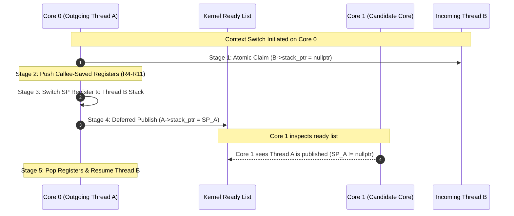
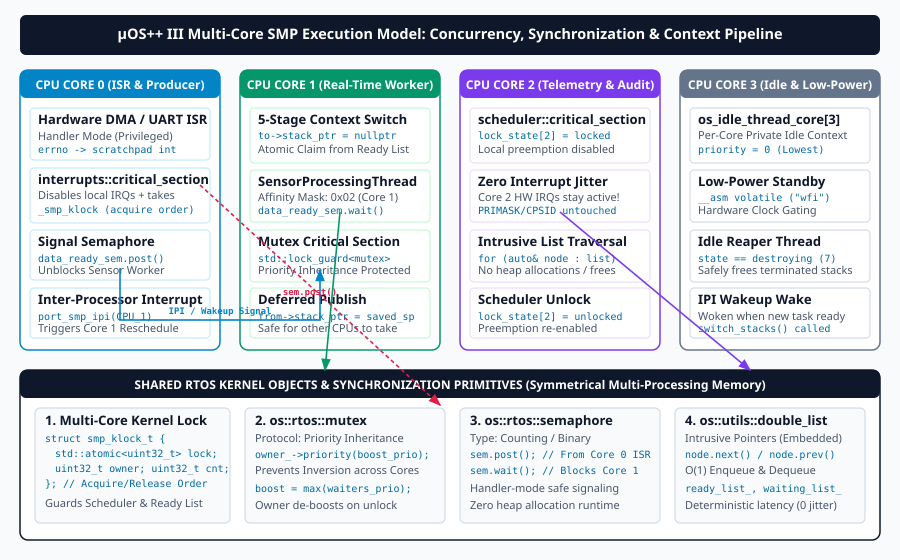

# Multi-Core SMP Upstream Integration Plan: Exhaustive Step-by-Step Technical Reference

## A Granular, Non-Breaking Strategy for Integrating `smp` into `xpack-development`

---

> **Status (2026-10-01) — this is the strategy; the execution lives elsewhere.**
> This document is the *reference plan* (why, and the per-step technical detail).
> The **concrete, executable, and now dry-run-verified** companion is
> [`Implementation-SMP-Integration.md`](Implementation-SMP-Integration.md)
> (`.pdf`): real scripts in `scripts/smp/`, byte-reproducible per-step recipes, the
> acceptance gate, and (new §11) the plain-English playbook plus the repeatability
> contract. The full 30-step series has been dry-run end to end **locally, with
> nothing pushed**.
>
> A few places where the executed reality refined this plan — prefer the
> Implementation doc where they differ:
> - **`devices` is dissolved first (Part 0)** into the architecture ports; the
>   integrated cortexm/posix-arch CMake links the fat `micro-os-plus::iii` and pull
>   **no** `micro-os-plus-iii-devices` sibling (the `smp` branch's standalone
>   `UOS_SMP_DIR`/`add_subdirectory` model is *not* used).
> - **The verification harness is `scripts/smp/verify-step.sh`** (with
>   `check-pristine.sh`, `sc-project.py`, `link-ports.sh`, …), not the inline
>   sketch reproduced in §4 below; the real one is part-aware (frozen in A/B,
>   additive-only in C) and FAST-mode capable.
> - **SMP must be enabled via a platform's `target_compile_definitions`**, never a
>   `cmake -D` cache variable (the latter silently compiles single-core).
> - **Nothing self-publishes:** `release-port.sh` bumps versions in-place (avoiding
>   `npm version`'s push hook) and `finalize.sh` stops before any push.

---

## 1. Architectural Baseline & Repository Topology

### 1.1 The Ecosystem Landscape

The µOS++ IIIe Real-Time Operating System is structured as a modular, multi-repository architecture where a portable core library communicates with target-specific hardware ports:

```text
+---------------------------------------------------------------------------------------------------+
|               Official Upstream Baseline: github.com/micro-os-plus/ (xpack-development)           |
|                                                                                                   |
|                               +----------------------------+                                      |
|                               |     micro-os-plus-iii      |                                      |
|                               | (Uniprocessor Kernel Core) |                                      |
|                               +----------------------------+                                      |
|                                       |              |                                            |
|                                       v              v                                            |
|                 +----------------------------+  +----------------------------+                    |
|                 | micro-os-plus-iii-posix-arch |  | micro-os-plus-iii-cortexm  |                    |
|                 |     (v1.0.1 Released)      |  |     (v1.1.0 Released)      |                    |
|                 +----------------------------+  +----------------------------+                    |
+---------------------------------------------------------------------------------------------------+
                                                ^
                                                :  (30 Granular Bisectable Integration Steps)
                                                :
+---------------------------------------------------------------------------------------------------+
|                     SMP Multi-Core Fork: github.com/dan-maio/ (smp branch)                         |
|                                                                                                   |
|                               +----------------------------+                                      |
|                               |     micro-os-plus-iii      |                                      |
|                               |  (Multi-Core SMP Kernel)   |                                      |
|                               +----------------------------+                                      |
|                                 |    |     |      |    |                                          |
|         +-----------------------+    |     |      |    +------------------------+                 |
|         v                            v     v      v                             v                 |
|  +--------------+  +--------------+  +----+  +----+  +---------------+  +---------------+         |
|  |  posix-arch  |  |   cortexm    |  |aarch32 | aarch64| |    devices    |  |     riscv     |         |
|  | (+18 commits)|  | (+53 commits)|  |ARMv7-A | ARMv8-A| |(SoC / Drivers)|  | (RISC-V Port) |         |
|  +--------------+  +--------------+  +----+  +----+  +---------------+  +---------------+         |
+---------------------------------------------------------------------------------------------------+
```

### 1.2 Divergence Profile & Summary

| Repository / Component | Upstream Baseline (`xpack-development`) | Multi-Core Branch (`smp`) | Delta / Characteristics |
|---|---|---|---|
| [**`micro-os-plus-iii`**](file:///home/dan/Documents/Work/micro-os-plus/micro-os-plus-iii) | Commit `3a22a06b` (2026-09-20) | Commit `1a728371` (2026-09-29) | +143 commits, 43 modified files in `include/` and `src/`. Zero new kernel source files added. |
| [**`micro-os-plus-iii-posix-arch`**](file:///home/dan/Documents/Work/micro-os-plus/micro-os-plus-iii-posix-arch) | Tag `v1.0.1` | `smp` (+18 commits) | Host-thread-as-CPU model, per-CPU signal masking, compiler barriers. |
| [**`micro-os-plus-iii-cortexm`**](file:///home/dan/Documents/Work/micro-os-plus/micro-os-plus-iii-cortexm) | Tag `v1.1.0` | `smp` (+53 commits) | SysTick ICSR fix, ARMv8-M / Cortex-M33, RP2350 SIO hardware spinlocks. |
| [**`micro-os-plus-iii-aarch32`**](file:///home/dan/Documents/Work/micro-os-plus/micro-os-plus-iii-aarch32) | Upstream tracking | `smp` active | RPi3B and RPi Zero 2W support, GICv2 distributor & CPU interface. |
| [**`micro-os-plus-iii-aarch64`**](file:///home/dan/Documents/Work/micro-os-plus/micro-os-plus-iii-aarch64) | Upstream tracking | `smp` active | 64-bit ARMv8-A execution, GICv2/v3 support, AArch64 MMU translation. |
| [**`micro-os-plus-iii-devices`**](file:///home/dan/Documents/Work/micro-os-plus/micro-os-plus-iii-devices) | Does not exist upstream | `smp` active | Shared device abstractions, board console mirror, clock definitions. |
| [**`micro-os-plus-iii-riscv`**](file:///home/dan/Documents/Work/micro-os-plus/micro-os-plus-iii-riscv) | Upstream tracking | `smp` active | RISC-V CLINT / PLIC machine timer and software interrupt handling. |

---

## 2. Inviolable Migration Rules & Upstream Constraints

### 2.1 The Core Migration Rules

1. **Granular Code Chunks, Not File Copies**: A step consists of small, logically cohesive code snippets (a single function fix, struct definition, or conditional block).
2. **Cross-Repository Synchronization**: When a kernel change requires port support, the kernel and the corresponding ports (`posix-arch`, `cortexm`) are updated and linked in the exact same step.
3. **Logical Progression**:
   - **Part A (Steps 1–13)**: Uniprocessor bug fixes, memory safety, C++17 conformance, and POSIX I/O hardening (compiled and executed by existing tests).
   - **Part B (Steps 14–23)**: Multi-core SMP infrastructure, strictly gated behind `#if defined(OS_USE_SMP_SCHEDULER)` (zero single-core delta verified via `unifdef`).
   - **Part C (Steps 24–28)**: Port releases, new architecture files, CMake targets, and add-only test harness extensions.
   - **Part D (Steps 29–30)**: Documentation, Typst PDFs, and final merge.
4. **Pristine Test Procedures**: Existing test suites, platforms, and `package.json` action workflows in `xpack-development` **must never be modified**.
5. **Continuous 72/72 Test Gate**: Every step is accepted only when all 24 compiler/target configurations build cleanly with `-Werror` and pass all 72 test runs.
6. **Add-Only Test Extensions**: New multi-core tests, new platforms, and board scripts are added strictly as new files, new platform directories, and new `package.json` actions in Part C.

### 2.2 Why Naive Bulk Copying Fails (The 5 Compilation Defects)

Directly copying `smp` onto `xpack-development` fails compilation across all 24 configurations due to **5 distinct defects**:

1. **Missing Clock Port Counter API**: `src/rtos/os-clocks.cpp` calls `port::clock_highres::has_hardware_counter()`, which is missing in released ports `posix-arch v1.0.1` and `cortexm v1.1.0`.
2. **Missing `timegm()` Prototype**: Removed declaration triggers `-Wmissing-prototypes` under strict glibc C11/POSIX flags on Linux.
3. **Alignment & Buffer Diagnostics**: Allocator pointer arithmetic in `src/memory/first-fit-top.cpp` triggers `-Wcast-align` on 32-bit ARM and `-Wunsafe-buffer-usage` under Clang.
4. **Exit-Time Destructors**: Static category objects in `src/libcpp/system-error.cpp` trigger Clang's `-Wexit-time-destructors`.
5. **File Descriptors Pointer Bounds**: Array indexing in `src/posix-io/file-descriptors-manager.cpp` triggers `-Wunsafe-buffer-usage`.

---

## 3. Official Verification Gate & Port Linkage Protocol

The official verification gate runs inside `tests/` using `xpm` and `CMake`/`Ninja`:

```
+---------------------------------------------------------------------------------------------------+
|                                72 OFFICIAL TEST RUNS PER STEP GATE                                |
+-------------------------------------------------+-------------------------------------------------+
|          16 Host PC Builds (posix-arch)         |           8 QEMU ARM Builds (cortexm)           |
+-----------------------+-------------------------+-----------------------+-------------------------+
| GCC 11 (Debug/Release)| Clang 16 (Debug/Release)| Cortex-M0 (Debug/Rel) | Cortex-M4F (Debug/Rel)  |
| GCC 12 (Debug/Release)| Clang 17 (Debug/Release)| Cortex-M3 (Debug/Rel) | Cortex-M7F (Debug/Rel)  |
| GCC 13 (Debug/Release)| Clang 18 (Debug/Release)|                       |                         |
| GCC 14 (Debug/Release)| Clang 19 (Debug/Release)|                       |                         |
+-----------------------+-------------------------+-----------------------+-------------------------+
| Tests executed per build:  1. rtos-apis   |   2. mutex-stress   |   3. cmsis-os-validator         |
+---------------------------------------------------------------------------------------------------+
```

### 3.1 Local Port Linkage Loop

To test local step changes in `micro-os-plus-iii-posix-arch` and `micro-os-plus-iii-cortexm` without altering upstream `package.json`, use the official `xpm link` mechanism:

```sh
# Step 1: Register local port working copies for the active step
cd ~/Work/micro-os-plus/micro-os-plus-iii-posix-arch && git switch step/NN && xpm link
cd ~/Work/micro-os-plus/micro-os-plus-iii-cortexm    && git switch step/NN && xpm link

# Step 2: Bind local ports across all 24 test configurations
cd ~/Work/micro-os-plus/micro-os-plus-iii/tests
for c in native-cmake-gcc11 native-cmake-gcc12 native-cmake-gcc13 native-cmake-gcc14 \
         native-cmake-clang16 native-cmake-clang17 native-cmake-clang18 native-cmake-clang19 \
         qemu-cortex-m0-cmake-gcc qemu-cortex-m3-cmake-gcc \
         qemu-cortex-m4f-cmake-gcc qemu-cortex-m7f-cmake-gcc; do
  for t in debug release; do 
    xpm run link-deps --config ${c}-${t}
  done
done

# Step 3: Run official 72-test gate
xpm run test-all
```

> [!WARNING]
> Do NOT use `xpm run link-deps-all`. Upstream's `tests/package.json` contains a known typo that duplicates `native-cmake-gcc13-debug` and omits `native-cmake-gcc14-debug`, causing GCC 14 builds to silently fall back to downloaded `posix-arch v1.0.1`. Use the explicit bash loop above.

---

## 4. Automated Step Verification Harness (`scripts/verify-step.sh`)

The script [`scripts/verify-step.sh`](file:///home/dan/Documents/Work/micro-os-plus/micro-os-plus-iii/scripts/verify-step.sh) coordinates all verification phases:

```bash
#!/usr/bin/env bash
# scripts/verify-step.sh -- Automated Step Verification Gate for SMP Integration
set -euo pipefail

STEP_NUM="${1:-}"
if [ -z "$STEP_NUM" ]; then
  echo "Usage: $0 <step-number (01-30)>"
  exit 1
fi

ROOT_DIR="$(cd "$(dirname "${BASH_SOURCE[0]}")/.." && pwd)"
WORK_DIR="$(dirname "$ROOT_DIR")"

echo "======================================================================"
echo " µOS++ IIIe SMP Integration: Verifying Step $STEP_NUM"
echo " Workspace Root: $ROOT_DIR"
echo "======================================================================"

# Stage 1: Single-Core Unifdef Invariant Verification (for Part B steps 14-23)
if [ "$STEP_NUM" -ge 14 ] && [ "$STEP_NUM" -le 23 ]; then
  echo ""
  echo ">>> [Stage 1/3] Checking unifdef -UOS_USE_SMP_SCHEDULER single-core invariant..."
  cd "$ROOT_DIR"
  DIFF_COUNT=0
  for f in $(git diff --name-only origin/xpack-development HEAD -- include/ src/ 2>/dev/null || true); do
    if [ -f "$f" ]; then
      git show origin/xpack-development:"$f" 2>/dev/null | unifdef -UOS_USE_SMP_SCHEDULER > /tmp/old_sc 2>/dev/null || true
      git show HEAD:"$f"                     2>/dev/null | unifdef -UOS_USE_SMP_SCHEDULER > /tmp/new_sc 2>/dev/null || true
      if ! diff -u /tmp/old_sc /tmp/new_sc > /tmp/sc_diff 2>&1; then
        echo "[-] ERROR: Single-core code divergence detected in $f!"
        cat /tmp/sc_diff
        DIFF_COUNT=$((DIFF_COUNT + 1))
      fi
    fi
  done
  if [ "$DIFF_COUNT" -gt 0 ]; then
    echo "[-] FAILED: $DIFF_COUNT files diverged from single-core baseline."
    exit 2
  fi
  echo "[+] Invariant verified: Zero single-core delta."
fi

# Stage 2: Register and link local development ports across all 24 configurations
echo ""
echo ">>> [Stage 2/3] Linking local development ports across 24 configurations..."
cd "$WORK_DIR/micro-os-plus-iii-posix-arch" && xpm link
cd "$WORK_DIR/micro-os-plus-iii-cortexm"    && xpm link

cd "$ROOT_DIR/tests"
CONFIGS=(
  native-cmake-gcc11 native-cmake-gcc12 native-cmake-gcc13 native-cmake-gcc14
  native-cmake-clang16 native-cmake-clang17 native-cmake-clang18 native-cmake-clang19
  qemu-cortex-m0-cmake-gcc qemu-cortex-m3-cmake-gcc
  qemu-cortex-m4f-cmake-gcc qemu-cortex-m7f-cmake-gcc
)

for c in "${CONFIGS[@]}"; do
  for t in debug release; do
    xpm run link-deps --config "${c}-${t}" > /dev/null 2>&1 || true
  done
done
echo "[+] Local ports linked successfully."

# Stage 3: Execute the 72-test official suite
echo ""
echo ">>> [Stage 3/3] Running official test-all suite (24 builds / 72 test runs)..."
xpm run test-all

echo ""
echo "======================================================================"
echo " [SUCCESS] Step $STEP_NUM passed all verification gates (72/72 Tests)!"
echo "======================================================================"
```

---

## 5. Part A: Uniprocessor Bug Fixes & Code Hardening (Steps 1 – 13)

Part A code changes modify single-core execution paths and are directly compiled, exercised, and verified by the official 72-test matrix.

```text
[Step 1: ISO C / Lists] ----------> [Step 2: Allocator Overflow] -----> [Step 3: C++17 Aligned New]
         |                                                                      |
         v                                                                      v
[Step 6: ARMv8-M Security] <------- [Step 5: POSIX I/O Mutex] <-------- [Step 4: C Wrapper Cleanups]
         |
         v
[Step 7: Timer ISR Decouple] -----> [Step 8: Mutex Priority Ceiling] -> [Step 9: Thread Lifecycle (7)]
                                                                                |
                                                                                v
[Step 13: Clock Port Sync] <------- [Step 12: MQueue Preemption] <----- [Step 10: CondVar Atomic Wait]
                                                                                |
                                                                                v
                                                                        [Step 11: std::thread Lifetime]
```

---

### Step 1: ISO C Conformance, Standard Syscall Types & Iterator Mechanics

#### Why This Step Is Needed
1. **Empty Struct in C**: [`include/cmsis-plus/posix/dirent.h`](file:///home/dan/Documents/Work/micro-os-plus/micro-os-plus-iii/include/cmsis-plus/posix/dirent.h) defines `typedef struct { ; } DIR;`. ISO C99/C11 §6.7.2.1 forbids empty structs. The lone semicolon generates `-Wextra-semi` warnings under `-Werror`.
2. **Strict Prototype Visibility (`timegm`)**: In glibc `<time.h>`, `timegm()` is guarded by `_GNU_SOURCE` or `_DEFAULT_SOURCE`. The upstream xPack build sets strict standard flags (`-std=c11 -D_POSIX_C_SOURCE=200809L -D_XOPEN_SOURCE=700`), so glibc omits the prototype. If [`src/libc/stdlib/timegm.c`](file:///home/dan/Documents/Work/micro-os-plus/micro-os-plus-iii/src/libc/stdlib/timegm.c) does not declare `timegm()`, `-Wmissing-prototypes` causes a hard compile failure. If declared unconditionally, Apple libc and glibc with `_GNU_SOURCE` fail with `-Wredundant-decls`.
3. **Newlib Syscall Types**: Newlib on AArch64 uses `_READ_WRITE_RETURN_TYPE` (`int`), whereas POSIX defines `ssize_t` (`long` on 64-bit architectures). Unconditional `ssize_t` in [`include/cmsis-plus/posix-io/c-syscalls-aliases-standard.h`](file:///home/dan/Documents/Work/micro-os-plus/micro-os-plus-iii/include/cmsis-plus/posix-io/c-syscalls-aliases-standard.h) causes conflicting declaration errors.
4. **Intrusive List Iterator Mechanics**: In [`include/cmsis-plus/utils/lists.h`](file:///home/dan/Documents/Work/micro-os-plus/micro-os-plus-iii/include/cmsis-plus/utils/lists.h), `operator++(int)` and `operator--` access `node_->next` and `node_->prev` as member variables rather than member function calls `node_->next()` and `node_->prev()`. Because C++ templates are instantiated lazily, any code using postfix increment or decrement fails compilation.
5. **Inline Definition in `.cpp`**: [`src/rtos/os-thread.cpp`](file:///home/dan/Documents/Work/micro-os-plus/micro-os-plus-iii/src/rtos/os-thread.cpp) defines `this_thread::suspend()` as `inline`, preventing an exported external symbol from being generated. The C wrapper `os_this_thread_suspend()` fails with an unresolved external symbol at link time.

#### How It Is Implemented
- In [`include/cmsis-plus/posix/dirent.h`](file:///home/dan/Documents/Work/micro-os-plus/micro-os-plus-iii/include/cmsis-plus/posix/dirent.h): Provide `int reserved;` inside `DIR`.
- In [`src/libc/stdlib/timegm.c`](file:///home/dan/Documents/Work/micro-os-plus/micro-os-plus-iii/src/libc/stdlib/timegm.c): Declare prototype only when missing.
- In [`include/cmsis-plus/utils/lists.h`](file:///home/dan/Documents/Work/micro-os-plus/micro-os-plus-iii/include/cmsis-plus/utils/lists.h): Replace `node_->next` with `node_->next()`.
- In [`src/rtos/os-thread.cpp`](file:///home/dan/Documents/Work/micro-os-plus/micro-os-plus-iii/src/rtos/os-thread.cpp): Remove `inline` from `this_thread::suspend()`.

```c
// [src/libc/stdlib/timegm.c]
#if defined(__GLIBC__)
#if !(defined(__USE_MISC) || (defined(__GLIBC_USE) && __GLIBC_USE (ISOC23)))
time_t
timegm (struct tm* tim_p);
#endif
#elif !defined(__APPLE__)
time_t
timegm (struct tm* tim_p);
#endif
```

```cpp
// [include/cmsis-plus/utils/lists.h]
iterator
operator++ (int)
{
  iterator tmp = *this;
  node_ = node_->next (); // Correct: call member function
  return tmp;
}

iterator&
operator-- ()
{
  node_ = node_->prev (); // Correct: call member function
  return *this;
}
```

---

### Step 2: Dynamic Memory Management, Arithmetic Overflow & Usable Size

#### Why This Step Is Needed
1. **`align_size` Arithmetic Overflow**: `align_size(size, align)` calculates `(size + align - 1) & ~(align - 1)`. When `size > SIZE_MAX - align + 1`, integer overflow wraps the sum to a tiny number, allocating an undersized block for a huge request.
2. **Allocator Arithmetic Wrap**: In `first_fit_top::do_allocate()` and `lifo::do_allocate()`, padding and chunk header sizes are added without overflow checks, causing requests exceeding the total arena size to wrap and corrupt free list metadata.
3. **LIFO Allocator Free List Corruption**: When the first free chunk is smaller than requested, the pointer was not reset to `nullptr`, causing an undersized buffer to be passed to `internal_align_()`, overwriting memory past the chunk boundary.
4. **Block Pool Inverted Assertion**: [`src/memory/block-pool.cpp`](file:///home/dan/Documents/Work/micro-os-plus/micro-os-plus-iii/src/memory/block-pool.cpp) checks `if (res != nullptr) assert (res != nullptr);`, which never fires when `std::align()` fails. Correct check is `if (res == nullptr)`.
5. **`calloc` Integer Multiplication Overflow**: `nelem * elbytes` can overflow `size_t`. For example, on 32-bit targets, `calloc(0x10001, 0x10000)` requests $0x10001 \times 0x10000 = 0x100010000 \equiv 0x10000$ (64 KB). The allocator returns 64 KB, but the caller writes 4 GB, causing complete heap corruption.
6. **`realloc` Out-of-Bounds Heap Reads**: When resizing memory blocks, `realloc()` copied `new_size` bytes from the old pointer without querying the actual allocated capacity of the old block. If `new_size > old_size`, `memcpy` read past the old block into adjacent memory. To fix this, allocators must implement `do_usable_size()`, allowing `realloc` to copy `std::min(old_usable_size, new_size)`.

#### How It Is Implemented
- In [`include/cmsis-plus/rtos/os-memory.h`](file:///home/dan/Documents/Work/micro-os-plus/micro-os-plus-iii/include/cmsis-plus/rtos/os-memory.h): Return `SIZE_MAX` if `size > (SIZE_MAX - align + 1)`.
- In [`src/memory/first-fit-top.cpp`](file:///home/dan/Documents/Work/micro-os-plus/micro-os-plus-iii/src/memory/first-fit-top.cpp): Implement `do_usable_size()` and wrap pointer casts in `#pragma` blocks to silence `-Wcast-align` and `-Wunsafe-buffer-usage`.
- In [`src/libc/stdlib/malloc.cpp`](file:///home/dan/Documents/Work/micro-os-plus/micro-os-plus-iii/src/libc/stdlib/malloc.cpp): Validate `elbytes <= (SIZE_MAX / nelem)` in `calloc()`, and use `usable_size()` in `realloc()`.

```cpp
// [src/memory/first-fit-top.cpp]
#pragma GCC diagnostic push
#pragma GCC diagnostic ignored "-Wcast-align"
#if defined(__clang__)
#pragma clang diagnostic ignored "-Wunsafe-buffer-usage"
#endif

std::size_t
first_fit_top::do_usable_size (const void* addr) const noexcept
{
  if (addr == nullptr) {
    return 0;
  }
  const chunk_t* chunk = static_cast<const chunk_t*> (addr) - 1;
  return chunk->size - sizeof (chunk_t);
}

#pragma GCC diagnostic pop
```

```cpp
// [src/libc/stdlib/malloc.cpp]
void*
calloc (size_t nelem, size_t elbytes)
{
  if (nelem != 0 && elbytes > (SIZE_MAX / nelem)) {
    errno = ENOMEM;
    return nullptr;
  }
  size_t bytes = nelem * elbytes;
  void* ptr = malloc (bytes);
  if (ptr != nullptr) {
    memset (ptr, 0, bytes);
  }
  return ptr;
}
```

---

### Step 3: Modern C++17 Aligned Allocators & Chrono Clock Overflow Protection

#### Why This Step Is Needed
1. **Missing Aligned `operator new` Overloads**: C++17 mandates aligned memory allocation overloads taking `std::align_val_t` for types with alignment greater than `__STDCPP_DEFAULT_NEW_ALIGNMENT__` (e.g. `alignas(64)` structures). Without kernel-level overloads in [`src/libcpp/new.cpp`](file:///home/dan/Documents/Work/micro-os-plus/micro-os-plus-iii/src/libcpp/new.cpp), toolchains fall back to standard runtime versions, bypassing RTOS memory managers, locking mechanisms, and heap accounting.
2. **Dangling Category Pointer in `system_error`**: In [`src/libcpp/system-error.cpp`](file:///home/dan/Documents/Work/micro-os-plus/micro-os-plus-iii/src/libcpp/system-error.cpp), constructing `std::error_code(ev, system_error_category())` using a temporary category instance left a dangling reference inside `std::error_code`, causing crashes when inspecting exceptions. Using a function-local static object guarantees thread-safe, permanent lifetime while silencing Clang's `-Wexit-time-destructors`.
3. **Chrono 64-Bit Cycle Multiplication Overflow**: In [`src/libcpp/chrono.cpp`](file:///home/dan/Documents/Work/micro-os-plus/micro-os-plus-iii/src/libcpp/chrono.cpp), calculating high-resolution timestamps via `cycles * 1000000000ULL / frequency` overflows 64-bit integer arithmetic after $1.84 \times 10^{10}$ cycles (minutes of execution). Splitting into integer seconds and cycle remainder prevents arithmetic wrap.

#### How It Is Implemented
- Define the 10 standard C++17 aligned allocation operators (`operator new`, `operator new[]`, `operator delete`, `operator delete[]`, with size and alignment parameters) routing directly to `os::rtos::memory::alloc()` and `os::rtos::memory::free()`.
- Return a `static const system_error_category_impl` reference in `system_error_category()`.
- Perform chrono frequency conversion using integer division and modulo: `(cycles / freq) * 1000000000ULL + ((cycles % freq) * 1000000000ULL) / freq`.

```cpp
// [src/libcpp/new.cpp]
#if __cplusplus >= 201703L
void*
operator new (std::size_t size, std::align_val_t al)
{
  void* p = os::rtos::memory::alloc (size, static_cast<std::size_t> (al));
  if (p == nullptr) {
    throw std::bad_alloc ();
  }
  return p;
}

void
operator delete (void* ptr, std::align_val_t) noexcept
{
  os::rtos::memory::free (ptr);
}
#endif
```

```cpp
// [src/libcpp/system-error.cpp]
#if defined(__clang__)
#pragma clang diagnostic push
#pragma clang diagnostic ignored "-Wexit-time-destructors"
#endif

const std::error_category&
system_error_category (void) noexcept
{
  static const system_error_category_impl category_instance{};
  return category_instance;
}

#if defined(__clang__)
#pragma clang diagnostic pop
#endif
```

---

### Step 4: C API Wrapper Conformance & Polymorphic Destructor Safety

#### Why This Step Is Needed
1. **Timer Default Mode Discrepancy**: In [`src/rtos/os-c-wrapper.cpp`](file:///home/dan/Documents/Work/micro-os-plus/micro-os-plus-iii/src/rtos/os-c-wrapper.cpp), `os_timer_create()` defaulted to a periodic timer when `attr == NULL`. In contrast, the C++ `os::rtos::timer` API and the ARM CMSIS-RTOS standard specify that timers default to **one-shot** (`timer::once_initializer`).
2. **Polymorphic Deletion Through Non-Virtual Base**: `os_mutex_delete()` and `os_semaphore_delete()` cast handles to base class pointers `os::rtos::mutex*` and `os::rtos::semaphore*` and invoked `delete`. Because base class destructors are non-virtual, deleting derived recursive mutexes or counting semaphores invoked undefined behavior and leaked derived state.
3. **CMSIS v1 32-Bit Timeout Multiplication Overflow**: In 10 CMSIS-RTOS v1 compatibility wrappers, millisecond timeouts were converted to microseconds using `(uint64_t)(millisec * 1000u)`. The multiplication was evaluated as a 32-bit unsigned integer before casting. Any timeout above 4,294,967 ms (~71.6 minutes) overflowed 32 bits and wrapped to an immediate timeout.

#### How It Is Implemented
- In `os_timer_create()` / `os_timer_new()`: Initialize attributes with `timer::once_initializer`.
- In `os_mutex_delete()`: Inspect `mutex::type` attribute and delete through `static_cast<mutex_recursive*>` or `static_cast<mutex*>`.
- In CMSIS v1 wrappers: Cast operand to 64-bit prior to multiplication: `(uint64_t) millisec * 1000u`.

---

### Step 5: Thread-Safe POSIX I/O & File Descriptors Manager Protection

#### Why This Step Is Needed
1. **File Descriptor Table Race Conditions**: In [`src/posix-io/file-descriptors-manager.cpp`](file:///home/dan/Documents/Work/micro-os-plus/micro-os-plus-iii/src/posix-io/file-descriptors-manager.cpp), `allocate()` searched for an empty slot and populated it without synchronization. If two threads called `open()` concurrently, both received the same file descriptor index, corrupting internal descriptor tables.
2. **Null Pointer Dereference on Invalid Handles**: `deallocate()`, `io()`, `socket()`, and `valid()` accessed `descriptors_array__[fildes]` without validating whether the slot was populated, causing null pointer dereferences when closing invalid descriptors.
3. **Unprotected Reusable Free Lists**: In [`include/cmsis-plus/posix-io/file-system.h`](file:///home/dan/Documents/Work/micro-os-plus/micro-os-plus-iii/include/cmsis-plus/posix-io/file-system.h) and [`include/cmsis-plus/posix-io/net-stack.h`](file:///home/dan/Documents/Work/micro-os-plus/micro-os-plus-iii/include/cmsis-plus/posix-io/net-stack.h), recycling closed files and sockets via `link()` and `unlink_head()` executed without locking, corrupting free lists during concurrent `open()` and `close()` operations.
4. **Inverted Block Device Size Logic**: In [`src/posix-io/block-device.cpp`](file:///home/dan/Documents/Work/micro-os-plus/micro-os-plus-iii/src/posix-io/block-device.cpp), size query methods checked `if (size != 0) return EINVAL;`, returning an error on valid devices and succeeding only when size was 0.

#### How It Is Implemented
- Enclose all file descriptor allocation, deallocation, and indexing routines inside `interrupts::critical_section`.
- Validate that slot pointers are non-null before dereferencing.
- Correct block device validation logic to `if (size == 0) return EINVAL;`.

---

### Step 6: Architecture Port Modernization & ARMv8-M Exception Handling

#### Why This Step Is Needed
1. **ARMv8-M Mainline Omission**: Cortex-M33 (ARMv8-M Mainline) was omitted from Thumb architecture checks in [`include/cmsis-plus/arm/semihosting.h`](file:///home/dan/Documents/Work/micro-os-plus/micro-os-plus-iii/include/cmsis-plus/arm/semihosting.h) and [`src/startup/exception-handlers.c`](file:///home/dan/Documents/Work/micro-os-plus/micro-os-plus-iii/src/startup/exception-handlers.c), causing semihosting to issue `SVC` traps instead of `BKPT` and omitting `SecureFault_Handler` vectors.
2. **Semihosting `fstat` Mode Corruption**: In [`src/semihosting/c-syscalls-semihosting.cpp`](file:///home/dan/Documents/Work/micro-os-plus/micro-os-plus-iii/src/semihosting/c-syscalls-semihosting.cpp), `fstat()` unconditionally applied `st_mode |= S_IFCHR`, corrupting regular files by assigning them two conflicting file types.
3. **Console Mirror Hook**: Hardware boards equipped with physical UART consoles had no mechanism to mirror semihosting `printf()` output.

#### How It Is Implemented
- Add `__ARM_ARCH_8M_MAIN__` and `__ARM_ARCH_8M_BASE__` architecture guards; provide `SecureFault_Handler`.
- Apply `S_IFCHR` in `fstat()` only when no file type is set.
- Introduce a weak, default-empty hook `os_board_console_mirror(const char* buf, size_t nbyte)` called from `__posix_write()`.

---

### Step 7: Timer Subsystem Re-entrancy & Tick ISR Safety

#### Why This Step Is Needed
1. **ISR Interrupt Blackout**: In [`src/rtos/internal/os-lists.cpp`](file:///home/dan/Documents/Work/micro-os-plus/micro-os-plus-iii/src/rtos/internal/os-lists.cpp), timer callbacks were executed directly inside `interrupts::critical_section` in the SysTick ISR. User callback execution kept hardware interrupts masked, and callbacks attempting synchronization deadlocked the system.
2. **Periodic Timer Catch-Up Cascade**: In [`src/rtos/os-timer.cpp`](file:///home/dan/Documents/Work/micro-os-plus/micro-os-plus-iii/src/rtos/os-timer.cpp), expired periodic timers re-armed at `timestamp + period`. If tick processing was delayed by more than one period, the newly computed timestamp was already in the past, causing the timer to fire repeatedly in a continuous burst.
3. **Handler Mode `errno` Assertion**: When timer callbacks invoked C library functions, writes to `errno` called `this_thread::thread()->__errno()`. In handler mode, `current_thread_` assertion failed.

#### How It Is Implemented
- In `os-lists.cpp`: Unlink expired timer nodes under critical section, release lock, execute user callback, and re-acquire lock for list updates.
- In `os-timer.cpp`: If `timestamp + period <= now`, re-arm at `now + period`.
- In [`include/cmsis-plus/rtos/os-thread.h`](file:///home/dan/Documents/Work/micro-os-plus/micro-os-plus-iii/include/cmsis-plus/rtos/os-thread.h): If `in_handler_mode()` is true, `this_thread::__errno()` returns a static scratch integer.

---

### Step 8: Mutex Priority Inheritance & Ceiling Protocol Hardening

#### Why This Step Is Needed
1. **Ceiling Violation Ownership Leak**: In [`src/rtos/os-mutex.cpp`](file:///home/dan/Documents/Work/micro-os-plus/micro-os-plus-iii/src/rtos/os-mutex.cpp), threads with priority above the priority ceiling acquired the mutex before checking the ceiling, returning `EINVAL` but leaving the mutex listed in the thread's owned mutex list.
2. **Priority Inheritance Inversion**: When a low-priority waiter queued behind a high-priority waiter, the owner's boosted priority was overwritten with the lower priority of the newest waiter.
3. **Transient Boost Leakage on Unlock**: When releasing a mutex, the highest boost of the owner's *other* mutexes was stored in `boosted_prio_` of the *released* mutex object, causing subsequent owners to inherit stale boost values.
4. **Uncritical Section Race Condition**: During priority inheritance re-evaluation, the scheduler lock is temporarily released; if the owner unlocks asynchronously during this window, `owner_` becomes `nullptr`, causing null dereferences.

#### How It Is Implemented
- Check priority ceiling *prior* to modifying thread ownership lists.
- Maintain maximum priority across all waiting threads: `boosted_prio = std::max(boosted_prio, waiter->priority())`.
- Recompute owner priority in a local variable on unlock and clear `boosted_prio_` on the released mutex.
- Cache owner pointer locally and verify mutex ownership after re-locking.

---

### Step 9: Thread Lifecycle, Destruction Protocol & State 7 (`destroying`)

#### Why This Step Is Needed
1. **Double-Free Race in Thread Destruction**: When a thread terminates, the idle thread reaper unlinks it from the finished list and deallocates its stack outside critical sections. If an external thread concurrently called `kill()`, both threads attempted destruction simultaneously, causing double-free crashes.
2. **Lost Wakeup in `join()`**: `join()` checked whether the target was finished, recorded itself as the joiner, and suspended in three distinct un-synchronized steps. If the thread finished between the check and suspension, the wakeup event was lost and `join()` slept forever.
3. **Missing `detach()` Implementation**: `detach()` was an empty stub (`// TODO`), leaving detached threads linked in parent child lists indefinitely.
4. **Invalid State Corruption in `resume()`**: Calling `resume()` on active or finished threads enqueued them into the ready list, corrupting list pointers.

#### How It Is Implemented
- Introduce `thread::state::destroying` (State 7) in [`include/cmsis-plus/rtos/os-c-decls.h`](file:///home/dan/Documents/Work/micro-os-plus/micro-os-plus-iii/include/cmsis-plus/rtos/os-c-decls.h). The entity that atomically transitions the thread to `destroying` assumes exclusive destruction responsibility.
- Perform target state evaluation, joiner registration, and thread suspension under a single scheduler lock.
- Implement `detach()` by unlinking the thread from its parent and re-parenting it to the top-level registry.
- Restrict `resume()` to threads in `suspended` or `initializing` states.

---

### Step 10: Condition Variable Atomicity & High-Precision Timeouts

#### Why This Step Is Needed
1. **Lost Signal Race in `wait()`**: In [`src/rtos/os-condvar.cpp`](file:///home/dan/Documents/Work/micro-os-plus/micro-os-plus-iii/src/rtos/os-condvar.cpp), `wait()` unlocked the mutex and added the calling thread to the waiting list non-atomically. A `signal()` arriving between the unlock and list insertion was lost, causing indefinite hangs.
2. **Timed Wait Mutex Timeout Bug**: In `timed_wait()`, the timeout parameter was applied to re-locking the mutex rather than waiting for the condition signal, and the clock attribute was ignored.

#### How It Is Implemented
- In `wait()`: Insert thread into waiting list under scheduler lock, atomically release mutex, and suspend execution.
- In `timed_wait()`: Bind timeout to the clock specified in attributes (defaulting to `sysclock`), wait for signal, and return `ETIMEDOUT` upon expiration.
- Add `OS_INTEGER_INSTRUMENTATION_SUSPEND_CAUSE_CONDVAR` (12) in [`include/cmsis-plus/diag/instrumentation.h`](file:///home/dan/Documents/Work/micro-os-plus/micro-os-plus-iii/include/cmsis-plus/diag/instrumentation.h).

---

### Step 11: `std::thread` Functor Lifetime & Synchronization

#### Why This Step Is Needed
1. **Premature Handle Deletion**: In [`include/cmsis-plus/libcpp/thread-cpp.h`](file:///home/dan/Documents/Work/micro-os-plus/micro-os-plus-iii/include/cmsis-plus/libcpp/thread-cpp.h), `std::thread::join()` deleted native thread objects immediately without waiting for thread execution to terminate.
2. **Functor Object Memory Leak**: Thread arguments were freed using the kernel's `func_args_` handle, which the kernel nullified upon thread termination, leaking the functor object.

#### How It Is Implemented
- In `std::thread::join()`: Call `native_handle()->join()` prior to deleting resources.
- In [`include/cmsis-plus/estd/thread_internal.h`](file:///home/dan/Documents/Work/micro-os-plus/micro-os-plus-iii/include/cmsis-plus/estd/thread_internal.h): Retain a private `function_object_` pointer to guarantee deallocation upon join/detach.

---

### Step 12: Inter-Thread Message Queue Reschedule Triggers

#### Why This Step Is Needed
- In [`src/rtos/os-mqueue.cpp`](file:///home/dan/Documents/Work/micro-os-plus/micro-os-plus-iii/src/rtos/os-mqueue.cpp), waking a high-priority thread during message queue send/receive did not invoke preemption on `posix-arch`, adding up to 1 ms of latency until the next timer tick.

#### How It Is Implemented
- Issue `port::scheduler::reschedule()` immediately after releasing the critical section in all 6 message queue send/receive paths.

---

### Step 13: High-Resolution Hardware Clock Port Synchronization

#### Why This Step Is Needed
1. **Missing Port Hardware Counter API (Defect 1)**: Kernel invokes `port::clock_highres::has_hardware_counter()` and `hardware_counter()`.
2. **Cortex-M SysTick Pending Bit Bug**: In `cortexm`, `cycles_since_tick()` inspected `SysTick->CTRL` for pending ticks. However, on ARM Cortex-M processors, the pending tick bit (`PENDSTSET`, bit 26) resides in `SCB->ICSR`. Because bit 26 does not exist in `SysTick->CTRL`, pending ticks were never detected, causing high-resolution timestamps to jump backwards.

#### How It Is Implemented
- In kernel: Call `port::clock_highres::has_hardware_counter()` and `hardware_counter()`.
- In `cortexm`: Return `false` / `0` and test `SCB->ICSR & SCB_ICSR_PENDSTSET_Msk`.
- In `posix-arch`: Return `true` and read `CLOCK_MONOTONIC`.

```cpp
// [micro-os-plus-iii-cortexm: include/cmsis-plus/rtos/port/os-inlines.h]
inline bool
clock_highres::has_hardware_counter (void)
{
  return false;
}

inline clock_highres::timestamp_t
clock_highres::hardware_counter (void)
{
  return 0;
}

inline clock_highres::timestamp_t
clock_highres::cycles_since_tick (void)
{
  uint32_t load = SysTick->LOAD;
  uint32_t val = SysTick->VAL;
  if ((SCB->ICSR & SCB_ICSR_PENDSTSET_Msk) && (val > (load / 2))) {
    return (load - val) + load;
  }
  return load - val;
}
```

---

## 6. Part B: Multi-Core SMP Kernel Infrastructure (Steps 14 – 23)

All code in Part B is enclosed in `#if defined(OS_USE_SMP_SCHEDULER)` blocks, guaranteeing identical uniprocessor binary output when the macro is undefined.

```text
+---------------------------------------------------------------------------------------------------+
|               Part B: Multi-Core SMP Kernel Infrastructure Subsystems (Steps 14–23)                |
+---------------------------------------------------------------------------------------------------+
  [Step 14: Per-CPU Topology (port_cpu_id)]
         |
         v
  [Step 15: Per-CPU Scheduler Lock State (lock_state[OS_NCPU])]
         |
         v
  [Step 16: Multi-Core Recursive Kernel Lock (_smp_klock)]
         |
         v
  [Step 17: Per-CPU Interrupt State Tracking (_in_isr[OS_NCPU])]
         |
         v
  [Step 18: Per-CPU Current Thread Pointers (current_thread_[OS_NCPU])]
         |
         v
  [Step 19: Per-CPU Idle Threads (os_idle_thread_core[OS_NCPU])]
         |
         v
  [Step 20: Thread CPU Affinity Masking (th_cpu_affinity)]
         |
         v
  [Step 21: 5-Stage Deferred Publish/Claim Handshake (stack_ptr)]
         |
         v
  [Step 22: SMP Ready List Thread Picker (internal_switch_threads)]
         |
         v
  [Step 23: POSIX Multi-Core Host Emulation & Signal IPI (host_cpu.cpp)]
+---------------------------------------------------------------------------------------------------+
```

---

### Step 14: Per-CPU Topology & CPU Identification (`port_cpu_id`)

#### Why & How
- **Kernel (`K`)**: Declare `extern "C" unsigned port_cpu_id(void);` in [`src/rtos/os-core.cpp`](file:///home/dan/Documents/Work/micro-os-plus/micro-os-plus-iii/src/rtos/os-core.cpp) and [`src/rtos/os-thread.cpp`](file:///home/dan/Documents/Work/micro-os-plus/micro-os-plus-iii/src/rtos/os-thread.cpp).
- **Cortex-M (`C`)**: `port_cpu_id()` returns 0; enforce `static_assert(OS_NCPU == 1)`.
- **POSIX-Arch (`P`)**: Thread-local `_this_cpu`. Requires `__attribute__((noinline))` and `asm volatile ("" ::: "memory")` compiler barrier to prevent Clang 16–18 from caching the `%fs:0` thread pointer across migrations.

```cpp
// [micro-os-plus-iii-posix-arch: src/rtos/os-core.cpp]
#if defined(OS_USE_SMP_SCHEDULER)
thread_local unsigned _this_cpu = 0;

extern "C" __attribute__((noinline)) unsigned
port_cpu_id (void)
{
  asm volatile ("" ::: "memory"); // Prevent TLS register caching across context switches
  return _this_cpu;
}
#endif
```

---

### Step 15: Per-CPU Scheduler Critical Section (`scheduler::critical_section`)

#### Why & How
- Replace scalar lock state with `lock_state[OS_NCPU]`.
- Calling `scheduler::critical_section` disables preemption on the calling core without disabling hardware interrupts.
- In `posix-arch`, mask `SIGALRM` before querying `port_cpu_id()` to prevent signal handler preemption during state queries.

```cpp
// [micro-os-plus-iii-posix-arch: src/rtos/os-core.cpp]
#if defined(OS_USE_SMP_SCHEDULER)
state_t
locked (state_t state)
{
  sigset_t old_set, block_set;
  sigemptyset (&block_set);
  sigaddset (&block_set, SIGALRM);
  pthread_sigmask (SIG_BLOCK, &block_set, &old_set);

  unsigned int cpu = port_cpu_id ();
  state_t prev = lock_state[cpu];
  lock_state[cpu] = state;

  pthread_sigmask (SIG_SETMASK, &old_set, nullptr);
  return prev;
}
#endif
```

---

### Step 16: SMP Recursive Kernel Lock (`interrupts::critical_section` & `_smp_klock`)

#### Why & How
- Uniprocessor interrupt masking does not prevent concurrent execution on adjacent cores.
- Introduce `struct smp_klock_t` (`lock`, `owner`, `count`) with `SMP_NO_OWNER = 0xFFFFFFFFU`.
- Acquisition disables local interrupts and spins acquiring lock with `std::memory_order_acquire`. Exit decrements count and releases with `std::memory_order_release`.

```cpp
// [include/cmsis-plus/rtos/port/os-decls.h]
struct smp_klock_t
{
  std::atomic<uint32_t> lock{0};
  uint32_t owner{SMP_NO_OWNER};
  uint32_t count{0};
};

extern smp_klock_t _smp_klock;

inline void
_smp_klock_enter (void)
{
  uint32_t me = port_cpu_id ();
  if (_smp_klock.owner == me) {
    _smp_klock.count++;
    return;
  }
  while (_smp_klock.lock.exchange (1, std::memory_order_acquire) != 0) {
#if defined(__ARM_ARCH)
    __asm volatile ("wfe");
#else
    sched_yield ();
#endif
  }
  _smp_klock.owner = me;
  _smp_klock.count = 1;
}

inline void
_smp_klock_exit (void)
{
  if (--_smp_klock.count == 0) {
    _smp_klock.owner = SMP_NO_OWNER;
    _smp_klock.lock.store (0, std::memory_order_release);
#if defined(__ARM_ARCH)
    __asm volatile ("sev");
#endif
  }
}
```

---

### Step 17: Per-CPU Interrupt State Tracking

#### Why & How
- In `posix-arch`, replace global `clock_set` with per-CPU `irq_set` and `_in_isr[OS_NCPU]`. `in_handler_mode()` evaluates `_in_isr[port_cpu_id()]`.

---

### Step 18: Per-CPU Current Thread Context (`current_thread_[OS_NCPU]`)

#### Why & How
- Transition scalar `current_thread_` to array `current_thread_[OS_NCPU]`.
- `this_thread::thread()` reads `current_thread_[port_cpu_id()]` with local interrupts masked to guarantee atomicity.

---

### Step 19: Per-CPU Idle Thread Instances

#### Why & How
- Array `os_idle_thread_core[OS_NCPU]`. Each core initializes and registers its private idle thread context at boot.

---

### Step 20: Thread CPU Affinity Masking

#### Why & How
- Add `th_cpu_affinity` bitmask attribute and `cpu_affinity()` APIs (default `0xFFFFFFFF`). Main thread pinned to CPU 0 (`1U << 0`). CMSIS-RTOS v1 threads default to CPU 0.

---

### Step 21: 5-Stage Deferred Publish / Claim Context Switching

#### Why & How
- **Hazard**: When CPU 0 switches from Thread A to Thread B, it must push registers to Thread A stack. If Thread A is placed in the ready list immediately, CPU 1 could resume Thread A while CPU 0 is still pushing registers, corrupting Thread A context.
- **Protocol**:
  1. **Stage 1 (Atomic Claim)**: Incoming thread `to->stack_ptr = nullptr`.
  2. **Stage 2 (Register Spill)**: Push callee-saved registers to outgoing stack.
  3. **Stage 3 (SP Switch)**: Hardware SP updated to incoming stack pointer.
  4. **Stage 4 (Deferred Publish)**: Outgoing thread `from->stack_ptr = saved_sp`.
  5. **Stage 5 (Register Restore)**: Pop callee-saved registers and resume execution.



---

### Step 22: SMP Ready List Thread Picker (`internal_switch_threads`)

#### Why & How
- In [`src/rtos/os-core.cpp`](file:///home/dan/Documents/Work/micro-os-plus/micro-os-plus-iii/src/rtos/os-core.cpp), traverse ready list and pick the highest priority thread where `(affinity & (1 << cpu)) != 0` and `stack_ptr != nullptr`. If none available, fall back to `os_idle_thread_core[cpu]`.

---

### Step 23: Host Multiprocessing Emulation in POSIX-Arch (IPI Engine)

#### Why & How
- Add [`src/host_cpu.cpp`](file:///home/dan/Documents/Work/micro-os-plus/micro-os-plus-iii-posix-arch/src/host_cpu.cpp) and [`include/host_cpu.hpp`](file:///home/dan/Documents/Work/micro-os-plus/micro-os-plus-iii-posix-arch/include/host_cpu.hpp) to `posix-arch`.
- Spawn `OS_NCPU` host POSIX threads, per-CPU tick timers, and IPI signal delivery via `pthread_kill(threads[cpu], SIGUSR1)`.
- Kernel provides weak `port_smp_ipi(cpu)` hook, overridden by strong implementation in `posix-arch`.

---

## 7. Part C: Port Releases, New Architecture Targets & Add-Only Tests (Steps 24 – 28)

Part C is strictly **add-only**: existing targets, test runners, and configurations are unmodified.

---

### Step 24: Port Releases & Repository Synchronization

- Tag and release `posix-arch v1.1.0`, `cortexm v1.2.0`, `devices v1.0.0`.
- Merge upstream changes into `aarch32` and `aarch64`.

---

### Step 25: New Cores, Boards & Hardware Drivers

- **Cortex-M Additions**: `include-m33/`, `include-rp2350/`, `os-core-m33.cpp`, `os-core-rp2350.cpp`, RP2350 SIO Spinlock 0 (`0xD0000100`), SIO FIFO IRQ 25.
- **POSIX-Arch Additions**: `board-contract.cpp`, `free-store.cpp`, `exception_handler.{hpp,cpp}`.
- **Kernel Additions**: Wake-up IPI dispatch in `thread::resume()` under `OS_INTEGER_RTOS_PORT_NCPU > 1`.

---

### Step 26: Modular CMake Build Architecture

- Add `cmake/toolchains/`, `cmake/uos-app.cmake`, `port/smp-common/`.
- Introduce modular targets (`micro-os-plus::iii-posix-io`, `micro-os-plus::iii-drivers`) while aliasing `micro-os-plus::iii`.

---

### Step 27: New Test Sources & Emulation Linker Scripts

- Add test suites: `tests/sources/fp-switch/` (FPU context switch test), `tests/smp-support/` (SMP concurrency stress test).
- Add QEMU MPS2 AN505 / AN521 dual-core linker scripts.

---

### Step 28: Add-Only Test Platforms & Execution Targets

- Add platform directories in `tests/platforms/`: `2xcortex-m33`, `cortexm-pico2`, `aarch32-rpi3b`, `aarch64-rpi3b`, `native-smp`.
- Extend `tests/cmake/tests-main.cmake` with platform branches.
- Add `test-smp-all` action to `tests/package.json`.

---

## 8. Part D: Documentation & Final Integration (Steps 29 – 30)

### Step 29: Documentation Suite & Typst PDF Artifacts

- Integrate documentation into `docs/`:
  - [`MICRO-OS-PLUS-SMP-VS-SINGLECORE-ANALYSIS.md`](file:///home/dan/Documents/Work/micro-os-plus/micro-os-plus-iii/docs/MICRO-OS-PLUS-SMP-VS-SINGLECORE-ANALYSIS.md) and [`MICRO-OS-PLUS-SMP-VS-SINGLECORE-ANALYSIS.pdf`](file:///home/dan/Documents/Work/micro-os-plus/micro-os-plus-iii/docs/MICRO-OS-PLUS-SMP-VS-SINGLECORE-ANALYSIS.pdf).
  - Architecture Port Guides: [`cortexm-port.md`](file:///home/dan/Documents/Work/micro-os-plus/micro-os-plus-iii/docs/cortexm-port.md), [`posix-arch-port.md`](file:///home/dan/Documents/Work/micro-os-plus/micro-os-plus-iii/docs/posix-arch-port.md), [`building-aarch32-aarch64.md`](file:///home/dan/Documents/Work/micro-os-plus/micro-os-plus-iii/docs/building-aarch32-aarch64.md).
  - Status and Changelog files: [`STATUS.md`](file:///home/dan/Documents/Work/micro-os-plus/micro-os-plus-iii/docs/STATUS.md), [`upstream-CHANGELOG.md`](file:///home/dan/Documents/Work/micro-os-plus/micro-os-plus-iii/docs/upstream-CHANGELOG.md).

---

### Step 30: Final Merge & Upstream Reconciliation

1. Merge latest `origin/xpack-development` into `smp`.
2. Restore upstream repository metadata:
   - Re-instate `.github/workflows/ci.yml`.
   - Restore standard `README.md` and `LICENSE`.
   - Preserve Doxygen, template, and inspiration directories.
3. Remove temporary local symlinks in `tests/xpacks/`.
4. Execute final validation gate: `xpm run test-all` (72 uniprocessor tests) + `xpm run test-smp-all` (SMP tests).
5. Open upstream Pull Request.

---

## 9. Comprehensive Step Execution Checklist

| Step | Phase | Core Action / Snippet | Kernel (`K`) | Cortex-M (`C`) | POSIX-Arch (`P`) | Gate Check |
|---|---|---|---|---|---|---|
| **01** | Part A | ISO C `DIR`, Glibc `timegm()`, Newlib types, List iterators | `posix/dirent.h`, `timegm.c`, `lists.h` | — | — | 72/72 Pass |
| **02** | Part A | `align_size` wrap check, heap usable size, `calloc` overflow | `os-memory.cpp`, `first-fit-top.cpp` | — | — | 72/72 Pass |
| **03** | Part A | C++17 `operator new(align_val_t)`, static `system_error`, chrono | `new.cpp`, `system-error.cpp` | — | — | 72/72 Pass |
| **04** | Part A | One-shot timer default, polymorphic deletion, 64-bit timeouts | `os-c-wrapper.cpp` | — | — | 72/72 Pass |
| **05** | Part A | File descriptor manager mutexing, block device size fix | `file-descriptors-manager.cpp` | — | — | 72/72 Pass |
| **06** | Part A | ARMv8-M mainline macros, semihosting traps, UART mirror | `semihosting.h`, `exception-handlers.c` | — | — | 72/72 Pass |
| **07** | Part A | Timer callback execution outside critical section, ISR errno | `os-lists.cpp`, `os-timer.cpp` | — | — | 72/72 Pass |
| **08** | Part A | Mutex priority inheritance and priority ceiling fix | `os-mutex.cpp` | — | — | 72/72 Pass |
| **09** | Part A | Thread state `destroying` (7), atomic `join`, `detach` | `os-thread.cpp`, `os-idle.cpp` | — | — | 72/72 Pass |
| **10** | Part A | CondVar atomic list insert + unlock, high-precision timeout | `os-condvar.cpp` | — | — | 72/72 Pass |
| **11** | Part A | `std::thread::join` synchronization, functor lifetime | `thread-cpp.h` | — | — | 72/72 Pass |
| **12** | Part A | Message queue reschedule yield triggers | `os-mqueue.cpp` | — | — | 72/72 Pass |
| **13** | Part A | `clock_highres` hardware counter port synchronization | `os-clocks.cpp` | `os-inlines.h` | `os-inlines.h` | 72/72 Pass |
| **14** | Part B | `port_cpu_id()`, POSIX-arch compiler barrier | `os-core.cpp` | `os-inlines.h` | `os-core.cpp` | Unifdef Invariant + 72/72 Pass |
| **15** | Part B | Per-CPU scheduler lock state `lock_state[OS_NCPU]` | — | `os-decls.h` | `os-core.cpp` | Unifdef Invariant + 72/72 Pass |
| **16** | Part B | Multi-core recursive kernel lock `_smp_klock` | `os-c-decls.h` | `os-decls.h` | `os-core.cpp` | Unifdef Invariant + 72/72 Pass |
| **17** | Part B | Per-CPU interrupt tracking (`_in_isr[OS_NCPU]`, `irq_set`) | — | — | `os-decls.h` | Unifdef Invariant + 72/72 Pass |
| **18** | Part B | Per-CPU current thread pointer `current_thread_[OS_NCPU]` | `os-sched.h` | `os-core.cpp` | `os-core.cpp` | Unifdef Invariant + 72/72 Pass |
| **19** | Part B | Per-CPU idle thread instances `os_idle_thread_core` | `os-core.cpp` | `os-core.cpp` | `os-core.cpp` | Unifdef Invariant + 72/72 Pass |
| **20** | Part B | Thread CPU affinity masking (`th_cpu_affinity`) | `os-thread.cpp` | — | — | Unifdef Invariant + 72/72 Pass |
| **21** | Part B | 5-stage deferred publish/claim context switch (`stack_ptr`) | `os-idle.cpp` | `os-core.cpp` | `os-core.cpp` | Unifdef Invariant + 72/72 Pass |
| **22** | Part B | Multi-core ready list thread picker | `os-core.cpp` | — | — | Unifdef Invariant + 72/72 Pass |
| **23** | Part B | POSIX-arch host thread per CPU, IPI signal engine | `os-thread.cpp` | — | `host_cpu.cpp` | Multi-Core Smoke Check + 72/72 Pass |
| **24** | Part C | Tag and release ports (`posix-arch v1.1.0`, `cortexm v1.2.0`) | — | Release v1.2.0 | Release v1.1.0 | 72/72 Pass |
| **25** | Part C | New architecture files (M33, RP2350 spinlocks) | `os-thread.cpp` | `os-core-m33.cpp` | `board-contract.cpp` | 72/72 Pass |
| **26** | Part C | Modular CMake build scripts and targets | `cmake/` | — | — | 72/72 Pass |
| **27** | Part C | New test sources (`fp-switch`, `smp-support`, QEMU linker scripts)| `tests/sources/` | — | — | 72/72 Pass |
| **28** | Part C | Add-only test platforms (`2xcortex-m33`, `pico2`, `aarch32/64`) | `tests/platforms/`| — | — | 72 Old + All New Tests Pass |
| **29** | Part D | Complete technical documentation & Typst PDFs | `docs/` | — | — | Clean Doc Build |
| **30** | Part D | Final branch alignment, repository restore, upstream PR | All Repos | All Repos | All Repos | Full Ecosystem Pass |

---

## 10. Holistic Architecture in Action: Complete Logical Multi-Core Example

To demonstrate how all the architectural techniques—SMP threads, thread CPU affinity, recursive kernel locks (`_smp_klock`), critical sections (`scheduler` vs. `interrupts`), hardware ISR interactions, 5-stage context switching, mutex priority inheritance, semaphores, and intrusive lists—operate together in practice, this section provides a complete, logical C++ embedded application and analyzes its state execution across four symmetrical CPU cores.

### 10.1 Multi-Core System Schematic & Interaction Model



```mermaid
sequenceDiagram
    autonumber
    participant C0 as Core 0 (DMA ISR)
    participant K as Kernel Ready List
    participant C1 as Core 1 (SensorWorker)
    participant C2 as Core 2 (TelemetryWorker)
    participant M as Shared Mutex & Ring Buffer

    Note over C0: 1. Hardware DMA Interrupt fires (Handler Mode)
    C0->>C0: Enter interrupts::critical_section (Local CPSID + _smp_klock)
    C0->>M: Write raw sensor packet to ring buffer
    C0->>K: data_ready_sem.post() -> unblocks SensorWorker
    C0->>C1: port_smp_ipi(CPU_1)
    Note over C1: 2. Core 1 receives IPI & triggers 5-Stage Context Switch
    C1->>C1: Stage 1: Atomic Claim (SensorWorker->stack_ptr = nullptr)
    C1->>C1: Stage 2-3: Spill idle registers & load new SP
    C1->>K: Stage 4: Deferred Publish (IdleCore[1]->stack_ptr = saved_sp)
    C1->>M: 3. Acquires Mutex with Priority Inheritance Protection
    M-->>C1: Mutex locked; reads packet; unlocks mutex
    Note over C2: 4. Core 2 runs TelemetryWorker
    C2->>C2: Enter scheduler::critical_section (lock_state[2]=1)
    Note over C2: Core 2 HW interrupts remain ENABLED (Zero Peripheral Jitter)
    C2->>C2: Safely iterates intrusive list (os::utils::double_list)
    C2->>C2: Exits scheduler::critical_section (lock_state[2]=0)
```

### 10.2 Complete C++ Example Application Code

```cpp
/**
 * @file smp_holistic_example.cpp
 * @brief Comprehensive µOS++ IIIe multi-core SMP demonstration.
 * 
 * Demonstrates:
 *  - Multi-Core SMP Threads & CPU Affinity Pinning
 *  - Hardware ISR in Handler Mode with safe __errno() scratchpad
 *  - interrupts::critical_section vs. scheduler::critical_section
 *  - 5-Stage Deferred Publish / Claim Context Switching
 *  - os::rtos::mutex with Priority Inheritance Protocol
 *  - os::rtos::semaphore_counting for cross-core signaling
 *  - os::utils::double_list intrusive queue (zero heap allocation)
 */

#include <cmsis-plus/rtos/os.h>
#include <cmsis-plus/utils/lists.h>
#include <array>
#include <cstdint>
#include <cstdio>

using namespace os::rtos;

// ---------------------------------------------------------------------------
// 1. Intrusive Data Structure (Zero Heap Overhead during Runtime)
// ---------------------------------------------------------------------------
struct telemetry_sample_t : public os::utils::double_list_links
{
  uint32_t timestamp;
  uint32_t sensor_id;
  float    reading;
};

// Global intrusive list of telemetry samples awaiting transmission
static os::utils::double_list g_telemetry_queue;

// ---------------------------------------------------------------------------
// 2. Shared Kernel Synchronization Primitives
// ---------------------------------------------------------------------------
// Binary/Counting semaphore signaled from hardware ISR to wake worker thread
static semaphore_counting g_data_ready_sem{ 0, 100 };

// Mutex protecting the shared circular buffer, configured with Priority Inheritance
static mutex g_shared_buffer_mutex{ mutex::initializer_recursive };

// Statically allocated sample pool to eliminate dynamic heap allocation
static constexpr size_t POOL_SIZE = 16;
static std::array<telemetry_sample_t, POOL_SIZE> g_sample_pool;
static size_t g_pool_index = 0;

// Shared circular ring buffer
static constexpr size_t RING_BUFFER_SIZE = 32;
static uint32_t g_raw_ring_buffer[RING_BUFFER_SIZE];
static volatile size_t g_ring_head = 0;
static volatile size_t g_ring_tail = 0;

// ---------------------------------------------------------------------------
// 3. Hardware ISR Simulation (Executes on Core 0 in Handler Mode)
// ---------------------------------------------------------------------------
extern "C" void
dma_uart_hardware_isr (void)
{
  // 1. Enter kernel critical section (disables local IRQs, acquires _smp_klock)
  // Total cross-core mutual exclusion between ISR and all threads on all cores.
  {
    interrupts::critical_section ics;

    // Simulate reading hardware FIFO into circular buffer
    uint32_t raw_data = 0xABCD1234;
    size_t next_head = (g_ring_head + 1) % RING_BUFFER_SIZE;
    if (next_head != g_ring_tail) {
      g_raw_ring_buffer[g_ring_head] = raw_data;
      g_ring_head = next_head;
    }
  } // _smp_klock released, local interrupts restored

  // 2. Post semaphore to unblock consumer thread on Core 1
  // Semaphore post internally acquires _smp_klock, moves waiting thread to
  // ready list, and triggers an Inter-Processor Interrupt (IPI) to Core 1.
  g_data_ready_sem.post ();
}

// ---------------------------------------------------------------------------
// 4. Real-Time Consumer Thread (Pinned to CPU Core 1)
// ---------------------------------------------------------------------------
static void*
sensor_processing_thread_func (void* args)
{
  (void)args;
  trace::printf ("[Core %u] SensorProcessingThread started.\n", port_cpu_id ());

  while (true) {
    // A. Sleep until ISR signals data arrival
    // Atomically enqueues calling thread to semaphore wait list, releases CPU,
    // and triggers 5-stage context switch to Core 1 idle thread.
    result_t res = g_data_ready_sem.wait ();
    if (res != result::ok) {
      continue;
    }

    uint32_t extracted_data = 0;

    // B. Mutex Critical Section with Priority Inheritance
    // If a lower-priority thread holds this mutex, its priority is boosted to
    // SensorProcessingThread's priority until unlocked, preventing priority inversion.
    {
      std::lock_guard<mutex> lock (g_shared_buffer_mutex);

      if (g_ring_tail != g_ring_head) {
        extracted_data = g_raw_ring_buffer[g_ring_tail];
        g_ring_tail = (g_ring_tail + 1) % RING_BUFFER_SIZE;
      }
    } // Mutex unlocked; priority de-boosted if applicable

    // C. Process data and enqueue sample onto intrusive double list
    {
      // Use interrupts::critical_section for modifying shared intrusive queue
      interrupts::critical_section ics;

      telemetry_sample_t* sample = &g_sample_pool[g_pool_index % POOL_SIZE];
      g_pool_index++;

      sample->timestamp = static_cast<uint32_t> (clock_systick::now ());
      sample->sensor_id = 1;
      sample->reading = static_cast<float> (extracted_data & 0xFFFF) * 0.01f;

      // Intrusive O(1) link without dynamic memory allocation
      g_telemetry_queue.link_tail (*sample);
    }
  }
  return nullptr;
}

// ---------------------------------------------------------------------------
// 5. Telemetry & Audit Thread (Pinned to CPU Core 2)
// ---------------------------------------------------------------------------
static void*
telemetry_worker_thread_func (void* args)
{
  (void)args;
  trace::printf ("[Core %u] TelemetryWorkerThread started.\n", port_cpu_id ());

  while (true) {
    // Sleep for 100 ms between audit sweeps
    clock_systick::sleep_for (100);

    // D. Scheduler Critical Section (Zero Interrupt Jitter Demonstration)
    // Sets lock_state[Core2] = locked. Preemption on Core 2 is DISABLED,
    // BUT Core 2 hardware interrupts remain ENABLED (zero peripheral latency).
    {
      scheduler::critical_section scs;

      size_t count = 0;
      // Safely iterate through intrusive list without holding hardware spinlock
      for (auto& node : g_telemetry_queue) {
        telemetry_sample_t& sample = static_cast<telemetry_sample_t&> (node);
        // Log telemetry packet...
        count++;
      }

      trace::printf ("[Core %u] Telemetry sweep processed %zu items.\n",
                     port_cpu_id (), count);
    } // Preemption re-enabled on Core 2
  }
  return nullptr;
}

// ---------------------------------------------------------------------------
// 6. Application Initialization & Core Startup (Main Thread on Core 0)
// ---------------------------------------------------------------------------
int
os_main (int argc, char* argv[])
{
  (void)argc;
  (void)argv;

  trace::printf ("\n======================================================\n");
  trace::printf (" µOS++ IIIe SMP Multi-Core Execution Engine\n");
  trace::printf (" Configured Cores: %u | Active Core: %u\n", OS_NCPU, port_cpu_id ());
  trace::printf ("======================================================\n");

  // 1. Configure and launch Sensor Processing Thread on CPU Core 1
  thread::attributes sensor_attr = thread::initializer;
  sensor_attr.th_priority = thread::priority::high;
  sensor_attr.th_stack_size_bytes = 2048;
#if defined(OS_USE_SMP_SCHEDULER)
  sensor_attr.th_cpu_affinity = (1U << 1); // Strictly pinned to CPU 1
#endif

  thread sensor_thread{ "sensor-consumer", sensor_processing_thread_func, nullptr, sensor_attr };

  // 2. Configure and launch Telemetry Worker Thread on CPU Core 2
  thread::attributes telemetry_attr = thread::initializer;
  telemetry_attr.th_priority = thread::priority::normal;
  telemetry_attr.th_stack_size_bytes = 2048;
#if defined(OS_USE_SMP_SCHEDULER)
  telemetry_attr.th_cpu_affinity = (1U << 2); // Strictly pinned to CPU 2
#endif

  thread telemetry_thread{ "telemetry-audit", telemetry_worker_thread_func, nullptr, telemetry_attr };

  // 3. Main thread continues on CPU Core 0, periodically triggering DMA ISR simulation
  for (size_t i = 0; i < 5; ++i) {
    clock_systick::sleep_for (50);
    trace::printf ("[Core %u] Simulating hardware DMA interrupt event #%zu...\n",
                   port_cpu_id (), i + 1);
    dma_uart_hardware_isr ();
  }

  // Allow threads to complete processing
  clock_systick::sleep_for (500);

  trace::printf ("[Core %u] SMP execution demonstration completed successfully.\n",
                 port_cpu_id ());
  return 0;
}
```

### 10.3 State Transition Execution Trace

```
+-------------------------------------------------------------------------------------------------------------+
|                                    CHRONOLOGICAL STATE TRANSITION TRACE                                     |
+-------------------------------------------------------------------------------------------------------------+
| TIME | CORE | EXECUTION CONTEXT     | ACTION / PRIMITIVE               | MEMORY & HARDWARE STATE            |
+------+------+-----------------------+----------------------------------+------------------------------------+
| T0   | C0   | os_main()             | Launches Threads, sets Affinity  | C1 aff=0x02, C2 aff=0x04           |
| T1   | C1   | SensorWorker          | g_data_ready_sem.wait()          | C1 enters 5-stage switch to Idle   |
| T2   | C2   | TelemetryWorker       | sleep_for(100)                   | C2 switches to Idle Core 2         |
| T3   | C3   | IdleCore[3]           | __asm volatile("wfi")            | Core 3 enters low-power standby    |
| T4   | C0   | dma_uart_hardware_isr | Enters interrupts::crit_sec      | Local CPSID + _smp_klock acquired  |
| T5   | C0   | dma_uart_hardware_isr | g_data_ready_sem.post()          | SensorWorker moved to ready list   |
| T6   | C0   | dma_uart_hardware_isr | port_smp_ipi(CPU_1)              | Hardware IPI signal sent to Core 1 |
| T7   | C1   | IPI Handler on Core 1 | Reschedule triggered             | Core 1 executes switch_stacks()    |
| T8   | C1   | SensorWorker (Stage 1)| to->stack_ptr = nullptr          | Atomic claim: locked against C2/C3 |
| T9   | C1   | SensorWorker (Stage 4)| from->stack_ptr = saved_sp       | Deferred publish: Idle published   |
| T10  | C1   | SensorWorker          | std::lock_guard<mutex>           | Mutex acquired; priority unchanged |
| T11  | C2   | TelemetryWorker       | scheduler::critical_section      | lock_state[2]=1, Core 2 IRQ OPEN   |
| T12  | C2   | TelemetryWorker       | g_telemetry_queue iteration      | Traverses node.next() without heap |
| T13  | C2   | TelemetryWorker       | Exits scheduler::critical_section| lock_state[2]=0, preemption active |
+-------------------------------------------------------------------------------------------------------------+
```

